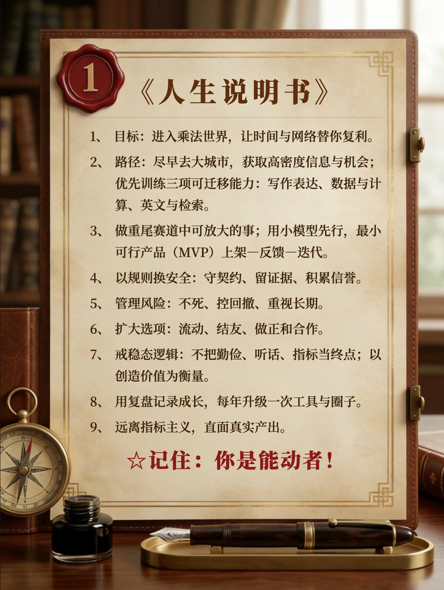

🔊 **能动：稳态生存的观念陷阱** | 转述：怀沙AI | 13:41

咱们来做个思想游戏。想象你是个功成名就的社会栋梁，也许是大企业家、社会活动家、著名科学家或者高级官员。此刻的你已经垂垂老矣，即将到达生命的终点。好消息是你会转世，而且下一世还投胎在中国；但坏消息是投胎完全是随机的，你大概率会投生到一个普通家庭，搞不好还是个贫困家庭。你肯定不甘于做个普通人，但游戏不允许你给来世储备秘密财富，而且你这一世的知识和技能也都会被忘掉。

现在游戏开了个后门儿：允许你给下一世的自己写一份《人生说明书》，等他长到能明白事理父母就会把这个说明书交给他。那么请问，你会写些什么？

我大概会告诉自己尽快前往一个大城市学习和生活，掌握几项可迁移的技能，争取不对称的优势，积累复利。为此我要让他理解「重尾分布」，明白为什么要想有大动作就得加入「乘法世界」。而为了跟上最新局面，应该先弄一部智能手机，也许上一个叫“得到”的APP学点见识……

一份说明书写不下太多东西，但我认为有一方面的内容你必须写上，因为别的地方大概不会讲 —— 那就是摆脱平庸观念的束缚。

我会在说明书上写：你周围的人，你的同学、老师，包括你的父母，都认为这些观念是天经地义的。可是殊不知那些人人都在用的梯子，多半只能到达人人能到的高度。如果你想要有大作为，你就必须超越这些观念。

这一讲咱们来梳理一下常见的平庸观念。我不想用“弱者”“底层”“前现代”之类的词形容这些观念，因为其实各个时代各个阶层都有人相信这些，这些是策略问题，不是阶层问题。

==我把它们称为「稳态生存逻辑」，因为平庸观念最大的特点，是追求稳定。==

✵

直到不久之前，中国绝大多数人都在过稳态生活。一个地方、一项技能、一份工作就是一辈子，周围是同一群人，稳态生存逻辑就是在这样的环境中演化出来的。今天的中国已经很不一样，一辈子可能换好几个职业，很多人会去远方求学和生活，原以为稳定的工作也可能失去，人一生的命运会有更多波动，按理说那套逻辑就不适用了。

然而有个规律叫「文化滞后（Cultural lag）」 [1]，意思是文化观念的更新总是比物质条件的改变慢很多。世界已经变了，但是人的观念不会及时升级，还沉浸在过去的叙事之中，于是就会自我限制。

简单说，==稳态生存逻辑有三大基因：资源匮乏、强从众和用简单模型看世界。==令现代人扼腕的很多坏习俗都能从这三个基因推演出来，比如风险厌恶、低能动性、面子文化和指标崇拜等等，真是不可不察。

也许人非得经过痛苦反思，把稳态生存逻辑解构掉，才能脱胎换骨……咱们一个一个说。

✵

==资源匮乏，==会让人专注于求生存，而顾不上求发展，更谈不上多姿多彩的自我表达。你站在富足时代看，会认为人们在匮乏时代的各种做法很无奈 —— 但当时现场的人可不认为那是不得已，因为他们从来就没考虑过还有别的可能性。他们把匮乏生存逻辑上升成了价值观、道德乃至于审美。

就拿食物来说，韩国的泡菜、英国的炸鱼薯条、美国社区聚会那种一家带一道菜的potluck等等，其实原本都是困难时期不得已的廉价果腹方法。可是人们习惯了，就会把它给美化，说这是我们的民族特色，是需要好好传承的文化。

再比如日本「侘寂（Wabi‑sabi）」文化，所谓对残缺的美学追求，也是起源于以前物资匮乏，东西坏了也得凑合着用，完了以此为荣。

借用麻省理工学院两个经济学家，摩西·霍夫曼（Moshe Hoffman）和埃雷兹·约耶里（Erez Yoeli）在《隐藏的博弈》一书中的说法 [2]，这叫「次级奖励（secondary rewards）」：你本来不喜欢这东西，是通过学习，才喜欢。

匮乏能解释很多事情。

比如「人情」。以前人们无力购买服务，有事儿必须邻里互助，今天你帮我搬家明天我帮你看小孩。这种互助看似随意，其实很重要，以至于大家会默默地记下人情债，最好谁也别吃亏。你可以偶尔透支一下，但你会对人情保持敏感。

还有过去中国特别讲「孝道」，孩子几乎是从懂事儿那天开始就在为给父母养老做精神准备，最好做到骨子里的顺从 —— 现在看那其实就是以情感绑架为手段的养老保险。等中国有了养老金，父母的独立性立即提高，也不非得跟子女同住了 [3]。你能说现代子女不孝吗？现实是有人对多个国家的研究发现 [4]，社会福利并没有削弱子女跟父母的关系，只是让那个关系更纯粹了，是自发的亲情而不是道德负担。

匮乏还会自动引发「零和」思维。资源就这么多，你多拿一点，我就少一点。人们会下意识地把他人当成竞争对手而不是合作伙伴，默认防御姿态。

零和思维的推论是贫穷代表道德，富人都是坏人。既然东西只有这么多，你多拿，就一定是占了别人的份额！你是巧取还是豪夺根本不重要，反正你肯定有问题！极端的时期人们以穷为荣。

✵

可能匮乏对头脑最深的影响，是「风险厌恶」。如果你有一百万元，也许不确定性是你的朋友；但如果你只有一千元，你没有资格做什么“投资”，这可是你保障生存的钱。

匮乏时代的人考虑的不是怎么赚钱，而是怎么省钱。这就是为什么「勤俭」是最重要的传统美德。勤的作用很有限，核心是俭。俭 = 低风险。

为什么过去的人对私德要求那么高，那么看重女性的贞洁？都是为了降低风险，毕竟意外怀孕的风险太高了。为什么传统社会讲“安土重迁”，特别不愿意离开老家去外地闯荡？因为外面的世界很危险。

风险厌恶大概是最根深蒂固的文化滞后。像现在是注意力稀缺的时代，你得非常善于表现自己才能被人看到，才能得到合作机会，对吧？那为什么家长们还在向孩子灌输“枪打出头鸟”的老道理，要求事事低调呢？因为他们仍然害怕被人嫉妒。

那个怕可以是无形的。再比如现代商业都讲究个「最小可行产品（Minimum Viable Product, MVP）」，你有什么想法应该先以最快的速度弄个初级版本就推向市场，边卖边改快速得到反馈快速迭代……可是有的人非得要完美的计划，希望万事俱备才行动，其实就是害怕失败。

传统社会一点都不鼓励你去冒险。

✵

==这就引出了从众心理。强从众是因为弱规则。==

如果一个社会有完善的规则，那么只要不明确违反规则的事儿你就都可以干，你大可理直气壮地个性化发挥。但是在弱规则社会，法律不能给你当挡箭牌，你往往不知道做什么事儿会得罪什么人，那么最安全的办法就是照着大多数人那样做。

强规则社会鼓励个性，弱规则社会鼓励一窝蜂。别人买啥就买啥，别人说啥就传啥，要么就没人要么就一大帮人，都是强从众的现象。

既然安全感是来自人际关系而不是来自法律，人们就会自动服从权威。乃至于顺从成了一种价值观。比如以前的家长夸孩子特别爱夸「听话」—— 现在你想想听话是优点吗？听话是自己没主意，是通往平庸之路。

顺从价值观的一个推论是「态度」。你干一个活儿，实际结果干没干好无所谓，关键是态度要好！

在这个态度文化之下，人们以忙碌为荣，有没有功劳不知道反正我有苦劳。再进一步，忙碌有时候还成了地位信号：有的人会炫耀自己有多忙。

你观察一下身边，是不是有大量无效的忙碌。比如学生学习，按理说你得看学会了什么，能不能学以致用，哪怕会考试也算真学进去了 —— 可是很多人根本不是在学习而是在做出学习的样子：反复地大声朗读、抄写、背诵，看着气势汹汹，其实不是有效的学习方法。

如果服从是一种业绩，态度就成了能力，姿势就成了成果。

强从众的另一个副产品是面子文化。决定做什么不看自己能不能得实际好处，而是先考虑别人为此会怎么看你。别人都买房所以你也必须买房，工资没多少先弄辆豪车，这些看似是求上进，其实还是从众。

那个从小被你夸听话的孩子，搞不好就成了假装学习、无效忙碌、逼着你给他拿结婚彩礼钱的孩子。

✵

==用简单思维模型看世界==是啥意思呢？我最近看到一个段子，有可能是真事儿 ——

有人借给一位同事8000块钱，等到还钱的时候，同事只还了7992元。为啥少8元呢？同事说：“你借给我钱是微信转账，我提现的时候微信扣了8元手续费，我只拿到7992元，所以我只能还你7992元。”

你理解其中的逻辑没有？这位同事是把外部世界当成了一个整体：我从世界拿到了7992元，所以我还回去7992元，这不很合理吗？Ta不能理解借钱是同事之间的信用关系，手续费是微信的事儿。这就是一个过度简单的思维模型。

简单的模型给人线性思维。

「努力」，就是一种线性思维。家长让孩子努力、领导让员工努力、每个人对自己说要努力 —— 可是往哪个方向努力？怎么努力才有效呢？人们不管这些，反正只要我努力了，世界就应该给我回报！

单纯的努力其实就是把外部世界当成了一个整体。我这么努力，怎么我挣钱还这么少呢？殊不知你根本没搞明白钱是怎么来的，你没有创造财富。你必须有个好一点的模型，才知道该做什么选择、在哪个领域、有没有杠杆、时机如何……要知道并没有一个神灵看你努力就给你发奖励。

很多人一说中国足球就骂球员不努力、没有拼搏精神，还跟“苏超”那种业余联赛对比，希望看到“纯粹的足球”，其实都是在渴望让世界变简单，是桃花源情结。业余联赛可以纯粹，但职业足球是复杂的，你必须理顺很多很多事情，这不是什么回到“初心”的问题。

简单思维模型的一个推论是「指标主义」，也就是一切为了达成某个指标。学习是为了考出好成绩拿到高学历，而读书反而不重要，因为“课外书”没有指标。

指标主义的言下之意是既然我达成了这个指标，世界就应该给我相应的待遇。我考上985大学就得拿高薪，我考上公务员就得有个又稳定又能升职的岗位……只知道世界欠我的，而不知道想想自己究竟能给世界提供什么。

✵

适应匮乏、强从众和简单模型对稳态生存来说不但够用，而且好用。从小听话、节俭、努力、做事随大流、从来不出头、又孝又顺的人，难道你不喜欢吗？如果你是个地主，你希望你家的佃农都是这种人；如果你是个开店的，你会希望服务员都有这些品质；如果你是个辛苦劳作只能勉强糊口的家长，你会认为子女的任何个性发挥都是制造麻烦。要不怎么大清向来「以孝治天下」。

别人期待你省心，肯干，不闯祸 —— 别人可没期待你兴旺发达。官办学校从来不是教人赚钱的地方，那是训练合格劳动者和守法居民的地方。

那些品质常常是很好的局部理性，但是从全局来看，却是把人困在陷阱里的枷锁。

==世人对低波动生存的痴迷是一座大山。但我们现在是个高波动世界。==

✵

真正爱孩子的家长应该希望孩子不要那么听话、不必过于努力、不用害怕群体压力，甚至敢去创造一点波动。

你最好有个足够复杂的思维模型，能理解各种事物的规律，能运用科学思维工具。

==但这一切的前提，是你得是个「能动者（agent）」，你是调用工具的人。你不能是别人的工具。==

**【收束小诗】**

> 古律如锁，
> 锁住饥寒与不安；
> 钥匙早已生锈——
> 你却把它挂在胸前，
> 当作信仰的徽章。

注释

[1] “Cultural Lag.” Wikipedia. Accessed Oct 2025. https://en.wikipedia.org/wiki/Cultural_lag.

[2] [《](igetapp://class/article?courseArticleId=100258&ddurlMinVer=5.2.0)[隐藏的博弈》1：主位解释和真正的解释](igetapp://class/article?courseArticleId=100258&ddurlMinVer=5.2.0)；Hidden Games: The Surprising Power of Game Theory to Explain Irrational Human Behavior, 2022.

[3] Chen, Xi. “The Impact of Social Pensions on Intergenerational Relationships: Evidence from China.” China Economic Review working version on PMC (2017).

[4] Daatland, Svein Olav, and Ariela Lowenstein. “Intergenerational Solidarity and the Family–Welfare State Balance.” European Journal of Ageing 2 (2005): 174–182.

> **📌 精华摘要**
>
> 基本世界观第三条：能动
> 这个世界早已高波动，旧观念却仍在滞后；别把稳态生存逻辑当真理，要做能动者，而不是旧叙事的工具。

如果真能转世，说明书该怎么写呢？GPT读罢此文后制作的一页版《人生说明书》——

