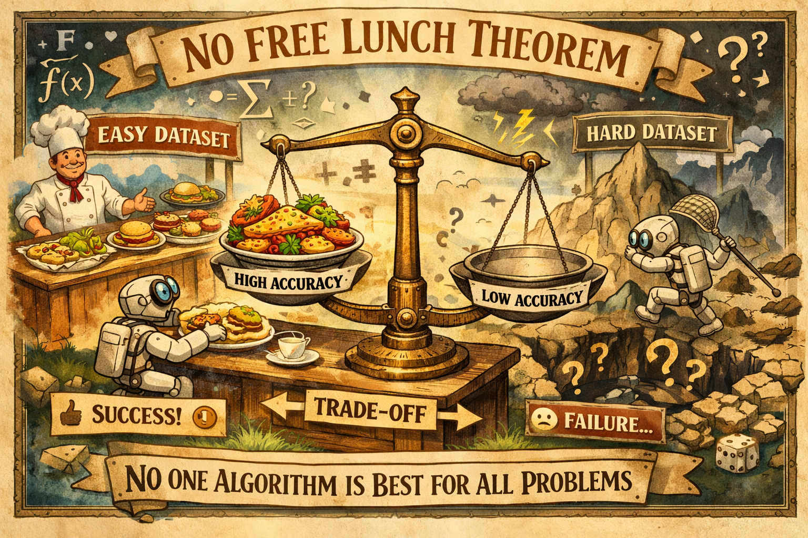
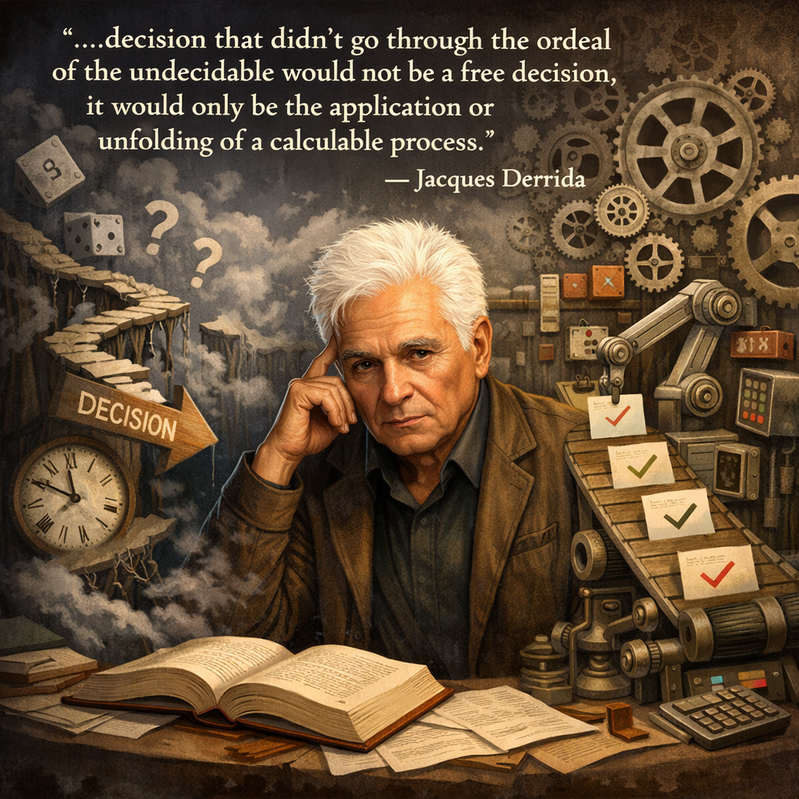

🔊 **无免费午餐定理：诸行无常，有偏置才有决策** | 转述：怀沙AI | 14:11

这一讲我们进入第二个板块，决策与判断，说白了就是如何发现最好的选项，如何评估局面，然后才是拍板执行。你想必已经听说过很多关于决策的说法了，我们这里的思维工具会给你更深的洞见 —— 但我想先跟你讲讲一切决策的「元规则」。

这个规则就是：世界上不存在完美的决策。

人们爱幻想完美决策。比如《三国演义》里，赵云保护刘备前往东吴，临行前诸葛亮送给他三个锦囊，说你遇到危难就拆开一个依计行事即可。结果果然好使。谁不想有个算无遗策的军师，谁不希望得到锦囊妙计呢？

可惜真实世界不是小说。秦始皇和朱元璋都曾经试图给后世搞好一揽子顶层设计，可是局面都很快就超出了他们的想象。但我们并没有吸取教训。

我们想要人生算法。我们希望有个课程直接说该选哪个专业怎么赚钱。我们建议用大数据找最优解。我们盼望 AI 提供最佳决策选项。就算这些做不到，我们也要求决策至少是“客观中立”的：排除所有的情绪和个人偏见，像解数学题一样算出正确答案。

我要说的是，这一切都是妄念。

世界上根本没有那么好的事儿。不管是诸葛亮、秦始皇还是朱元璋，你都不可能给事情做出完美的预先安排。人生没有算法，不存在放之四海而皆准的正确决策。

而且所谓“客观中立”，根本就是一个错误的要求。

你要坚持客观中立，你就什么都干不了。只要是决策就不可能是客观中立的。我敢这么说是因为这里有一个强硬的理论支持，叫做「==无免费午餐定理==（No Free Lunch Theorem，简称 NFL）」。

✵

无免费午餐定理出自计算机科学的算法优化理论，是两个计算机科学家，大卫·沃尔珀特（David Wolpert）和威廉·麦克雷迪（William Macready）1997 年提出来的 [1]。我真心希望你无论是搞哲学也好、社会科学也好，最好能有点跨界意识，了解一点计算机科学。这个定理就极为深刻，它等于是给智能提出了一个限制。

故事是这样的。当时的计算机科学界就好像武林大会一样，各家都在提出自己的优秀算法。有人说我这个遗传算法本来是模拟生物进化的，但我能用它发现工程上的解。有人说我这个模拟退火算法出自物理学，但它能帮你跳出数学上的局部最优。各家心想，我能不能找到一把“屠龙刀”，凭一套算法解决一大堆问题呢？或者干脆说，世界上有没有一个最好最通用的算法，能解决所有的问题呢？

沃尔珀特和麦克雷迪这个定理说，没有。他们用严格的数学证明：如果你把“所有可能问题”都平均起来看，那么任何两个算法的表现都是一样的。

换句话说，也许你这个算法在一类特定问题上表现得很出色，那么换到其他问题上，它必然就会失效。综合而论，如果一定想要求解所有问题，那么一个先进的设计芯片线路的算法，和一个只靠瞎蒙的随机猜测算法，表现是一样的。

这就叫==「世界上没有免费的午餐」：你想要在一个领域里表现得比别的算法好，你就必然在另一个领域里表现得比别的算法差。==AlphaGo 之所以下围棋那么厉害，是因为它偏科 —— 它为围棋这个特定问题进行了极度的优化 —— 你让它去画画它就完全不行了。

你必须为优化付出代价。

✵

佛学爱好者应该好好思考一下这个无免费午餐定理。我私下以为，无免费午餐定理等于宣告了任何有用之法，或者说「有为之法」，都是「有漏之法」：它一定不能解决所有的问题，一定是局限的。

你说「一切有为法，如梦幻泡影」，那么定理说这个世界根本就不存在圆满。什么都不做才是圆满。你但凡有点追求，就得使用有为之法，就得有漏，就得为优化付出代价，就得为了得到一些东西而放弃另一些东西，就得承受「有漏皆苦」。

所以「无免费午餐定理」就是科学版的「诸行无常」。

那些是题外话，但这个要点是：入世必须使用有漏法。

好消息是你可以自己选择你要解决哪一类问题，而这个选择一定是主观的。怎么选择呢？我们需要借用一个来自机器学习领域的术语，叫「==归纳偏置==（Inductive Bias）」。

所谓学习，就是从有限的过去经验中，归纳出无限的未来规律。可是人家大卫·休谟（David Hume，1711—1776）早就说了 [2]，归纳法在逻辑上是无法自洽的：昨天太阳升起，前天太阳升起，你凭什么就能推断明天太阳也会升起？也许明天宇宙的参数就变了呢？

机器要学习，就必须先把这个逻辑鸿沟填上。计算机科学家找到的答案是它必须先*盲目相信*点什么才行 [3] —— 也就是你得有「先验（Priors）」。你得先不问理由地相信点什么，才可能从有限经验中学习。

比如卷积神经网络（CNN）之所以处理图像特别厉害，是因为它预先植入了一个先验：它坚信“局部的特征组合起来是有意义的”以及“图像的特征在平移后是近似不变的”。循环神经网络（RNN）之所以处理语言厉害，是因为它的先验是坚信“前一个词和后一个词之间存在时间上的关联”。

站在绝对客观中立的立场上，那些先验并没有道理：你凭什么相信我们这个世界是这样的？也许世界随时就会变得散乱呢？但我们不管了 —— 我们宁可要这个偏见。预设的先验，就是归纳偏置。

如果没有这些偏置，也就是不带任何预设眼镜观察世界，那么你看到的其实是一片点阵和一串噪音。那些海量的数据会让算法觉得这种可能性也对、那种可能性也对，最后陷入瘫痪。

你必须先押注结构，才能找到结构，才能判断好结构。

✵

决策也是如此。说我老老实实坐在这里，调出这个世界所有的变量，进行精确的推演，算出所有的概率，让结果展现给我一个攻略，告诉我最应该做什么……这纯属妄想，因为违反无免费午餐定理。

现实是世界上有无数可以做的事，每个领域都有可能做成功。==你必须先*主观*选择一个领域，设定你对这个领域的归纳偏置，才可以展开具体调研，推算最佳决策。==

比如你有一天突发奇想，说“我要去广州工作赚钱” —— 这其实不是一个决策，这是「发愿」。但这个发愿对决策至关重要，没有发愿就没有决策。

世界这么大，人可以在各种各样的地方做各种各样的事，追求各种各样的目的，而你偏偏选择了去广州工作赚钱。没有任何科学决策理论能证明你这个想法是对还是错。有的人去广州工作是为了跟自己的女朋友在一起，有的人用别的方式赚钱，他们也都是对的。

“去广州”是你把搜索空间圈起来；“赚钱”是你把目标函数定下来；而你对“去广州可能赚钱”的直觉与信念，是你的归纳偏置。有了这个发愿，才谈得上决策：决策是我们*已经知道你想干啥*了，然后调研论证一番，看看在广州具体做什么工作、怎么做最能帮你赚钱。

==无免费午餐定理说：不管决策的过程有多么理性，决策的初心一定是一个任性。==

事实上，任性是决策必不可少的成分。

没有任何决策系统能够料事如神。最强 AI 也不可能把一件事儿的几个选项的概率分布以及有可能付出的代价给你清清楚楚地列明白，像古代谋士一样给你提供上、中、下三策，说主公你选一个就好。未来不但有不确定性而且有不可量化的不确定性，也就是连概率分布本身都具有不确定性。

这就意味着你算到最后总会有一些算不出来的地方。你归根结底会有一个时刻，心想：“不管了，我就非得这么干了，无所谓了。”还是法国哲学家德里达（Jacques Derrida）那句话说得最好：

「一个决断如果没有穿过无可决断之折磨，那它将不可能是一个自由的决断，它只会是程序化的应用或一个计算好的过程的展开。」

决断不是展开，而是承担。这就是为什么 AI 再强，也得有一大堆各种各样的「微决策」必须留给人来做。

✵

承认没有免费的午餐，理解了决策本质上是主观的冒险，可不是说我们就不要决策科学了。决策科学的作用有限，但往往很关键。这里咱们先说一说做决策的元认知心法，总共就三步。

==第一步，你必须有一个「强先验（Strong Prior）」，也就是设定偏置。==

为什么天下有这么多生意你不做，你非得做这个生意？为什么有这么多行业、这么多赛道你不选，你非得选这个赛道？没有客观答案。同样面对一个受伤的人，杀手需要的策略和医生需要的策略截然不同。你必须先有主观选择。

可能那是你的直觉，可能那是你的人生愿景，可能那是你纯粹莫名其妙的喜好，纯属偏见完全不讲道理 —— 但你必须先选一个方向才行。你如果不选，你就谈不上使用算法，在数学上你就是死路一条。有一张错误的地图也比没有地图强。

但偏置并非无章可循，它基本上来自两个地方 ——

一个是你的「价值观」，也就是什么东西对你来说是不可协商的：这辈子你绝对不做什么？什么代价你绝对不愿意支付？你非得追求什么？你认为什么最宝贵？AI 工程师会说这些是你给模型设定的「价值函数」或者说目标函数。

一个是「你对世界的基本假设」：你认为当前这个领域更像“线性递增”还是“重尾爆发”？你更相信“复利”还是“爆款”？这决定了你的搜索方向。

先有立场，才有展开。没有立场就无从搜索信息。

==第二步是算法搜索。==

无免费午餐定理说不存在放之四海而皆准的好算法，但是它允许在每个特定的局部问题上，存在一个最强算法。

我们要找到那个算法。我们要做好调研，进行分析推理、模拟未来演化。我们要寻找最佳选项，考虑值得付出的代价。

如果人人拥有最高智能，最佳算法就是由你上一步设定的价值函数，也就是你的偏置所决定的。任何一个决策都是在一定的条件下对方程求解：你想把那个价值函数给最大化。

到这一步你就必须非常理性客观了，得尊重世界的硬条件。那么这基本上是一个工程问题。我们后面所要讨论的各种决策工具，大多就在这一步。

==第三步是系统化冒险。==

也就是你得承认你正在冒险，你不能一条道走到黑。我们一直说设定「偏置（bias）」，我们说的可不是「偏执（Dogmatism）」。偏置是启动时候不得不先采取一个立场；而偏执则是一种执念，是环境已经反馈告诉你事情不是你想的那样，你一开始采取的那个立场是错的，你还要强行坚持。

偏置是剑，偏执是枷锁。老百姓要么“无偏置”（优柔寡断，试图客观），要么“全偏执”（一条道走到黑）。 高水平决策者则一定是「强偏置、弱偏执」：带着偏见上路，但发现走错了会马上换一种偏见。

这样你才能既能决策，又能调整和退出决策。

✵

为什么苹果的那套设计美学强，难道别的公司就没想到吗？答案是那只是乔布斯个人的审美偏置。你可以做大众化的兼容机个人电脑，也可以做美但是贵的电脑；你可以搞一个开放但无序的生态，也可以搞一个封闭但质量有保证的生态，这里没有对错。

巴菲特搞价值投资，买几只股票常年不动；可是文艺复兴科技的詹姆斯·西蒙斯（Jim Simons）搞量化交易，玩的是用算法在几毫秒的时间内做判断。那你说到底是巴菲特做得对，还是西蒙斯做得对呢？答案是都对 —— 能赚钱就是对的 —— 他们只是选择了不同的偏置。

如果这个东西又便宜又好，那个东西又贵又不好，人人都知道该选又便宜又好的，那不叫做决策。决策往往是在两难之中做选择：这个工作稳定但是上限低，那个工作有可能让你暴富但是波动大，你选哪个？

==没有客观中立的标准答案，你的决策归根结底取决于你的偏置。==

✵

世人总爱说什么要客观中立、要保持开放，但做事的前提恰恰是不中立、不尊重所有的意见、有立场、有方向。你要是不敢弄脏自己的手，你就永远不是局内人。

有了价值设定之后的判断要尽量客观，但是价值本身必须主观。无免费午餐定理要求你做一个有立场的能动者。有立场，但无执念；有权起心动念但也有权根据现实调整。避免“既要、又要、还要”，用自己的核心偏好设定价值函数，牺牲掉一部分维度来换取在另一部分维度上获得超额回报，这才叫决策。

AGI 时代人的核心价值就在于设定偏置：你决定要解决什么问题，你定义什么是好什么是坏，你在空白的纸面上画下第一笔。

什么都不做才是最完美、最没有偏见的状态。偏见是你生命力的证明。

==【收束小诗】==

> 混沌海中无智愚，
> 只有因缘聚此身。
> 万法皆空无定相，
> 一念起处是真神。

注释

[1] Wolpert, David H., and William G. Macready. 1997. “No Free Lunch Theorems for Optimization.” IEEE Transactions on Evolutionary Computation 1 (1): 67–82.

[2] Hume, David. 1748. An Enquiry Concerning Human Understanding.

[3] Mitchell, Tom M. 1980. “The Need for Biases in Learning Generalizations.” Technical Report, Rutgers University.

[4] Derrida, Jacques. 1992. “Force of Law: The ‘Mystical Foundation of Authority.’” In Deconstruction and the Possibility of Justice, edited by Drucilla Cornell, Michel Rosenfeld, and David Gray Carlson, 3–67. New York: Routledge.

> **📌 精华摘要**
>
> 1.无免费午餐定理：你想要在一个领域里表现得比别的算法好，你就必然在另一个领域里表现得比别的算法差。
> 2.你必须先*主观*选择一个领域，设定你对这个领域的归纳偏置，才可以展开具体调研，推算最佳决策。不管决策的过程有多么理性，决策的初心一定是一个任性。
> 3.做决策的元认知心法有三步：第一步，强先验设定偏置；算法搜索；系统化冒险。
