# Comprehensive Guide to Spec-Driven Development (SDD)

> *A synthesis of 22 sources — blog posts, industry analyses, practitioner guides, academic papers, and community discussions — covering the emerging discipline of Spec-Driven Development in the age of AI coding agents (2025–2026).*

---

## TL;DR — Explain It Like I'm in High School

Imagine you want to build a treehouse. You have two options:

**Option A (Vibe Coding):** You grab some wood and nails, start hammering, and figure it out as you go. It might look cool at first, but the floor is uneven, the door doesn't fit, and it leaks when it rains.

**Option B (Spec-Driven Development):** Before you touch a single piece of wood, you draw detailed blueprints — how big each wall is, where the door goes, what kind of roof you want. Then you hand those blueprints to a really fast robot carpenter (the AI), and it builds exactly what the blueprints say.

**SDD is Option B for software.** You write a detailed "blueprint" (called a *specification* or *spec*) first, then let AI coding tools build the actual code from that blueprint. The blueprint becomes the most important thing — not the code. If you want to change something, you change the blueprint and let the AI rebuild.


---

## Table of Contents

1. [What Is Spec-Driven Development?](#1-what-is-spec-driven-development)
2. [Why SDD Emerged Now](#2-why-sdd-emerged-now)
3. [The Specification Spectrum: Three Levels of Rigor](#3-the-specification-spectrum-three-levels-of-rigor)
4. [The Four-Phase SDD Workflow](#4-the-four-phase-sdd-workflow)
5. [What Makes a Good Spec](#5-what-makes-a-good-spec)
6. [The Constitutional Foundation](#6-the-constitutional-foundation)
7. [Tools and Frameworks](#7-tools-and-frameworks)
8. [SDD vs. TDD, BDD, and Vibe Coding](#8-sdd-vs-tdd-bdd-and-vibe-coding)
9. [Real-World Practitioner Experiences](#9-real-world-practitioner-experiences)
10. [Critiques and Limitations](#10-critiques-and-limitations)
11. [When to Use SDD (and When Not To)](#11-when-to-use-sdd-and-when-not-to)
12. [Academic Research Frontiers](#12-academic-research-frontiers)
13. [The Road Ahead](#13-the-road-ahead)
14. [Sources](#14-sources)

---

## 1. What Is Spec-Driven Development?

Spec-Driven Development (SDD) is a software engineering methodology where **specifications — not code — serve as the primary artifact** of development. Instead of coding first and writing documentation later, teams write detailed, structured specs first, then use AI coding agents to generate, plan, and implement code from those specs.

As GitHub's foundational document puts it: *"In this new world, maintaining software means evolving specifications. The lingua franca of development moves to a higher level, and code is the last-mile approach."* [2]

Wikipedia defines it formally: SDD is *"a software engineering methodology where a formal, machine-readable specification serves as the authoritative source of truth and the primary artifact from which implementation, testing, and documentation are derived."* [6]

The core insight is simple: AI coding agents are exceptional at pattern completion but struggle with unstated requirements. A vague prompt like "add photo sharing to my app" forces the AI to guess at formats, permissions, storage, and compression — each guess introduces risk. This is what practitioners call **"vibe coding."** Providing AI with unambiguous, structured specifications dramatically improves output quality. [1, 18]

### The Power Inversion

For decades, code has been king. Specifications served code — they were the scaffolding we built and then discarded once the "real work" of coding began. SDD inverts this power structure: **specifications don't serve code — code serves specifications.** The Product Requirements Document isn't a guide for implementation; it's the source that generates implementation. [2]

> **Simple analogy:** Think of it like music. In the old world, the *recording* (code) was the product and the *sheet music* (spec) was just a rough guide. In SDD, the *sheet music* becomes the real product — and any musician (or AI) can play it to produce a recording. If you want to change the song, you change the sheet music, not the recording.

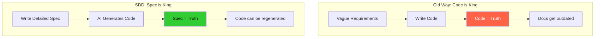

This inversion is now possible because AI can understand and implement complex specifications. But raw AI generation without structure produces chaos. SDD provides that structure through specifications precise and complete enough to generate working systems. [2]

---

## 2. Why SDD Emerged Now

Three converging forces made SDD not just possible but necessary in 2025–2026:

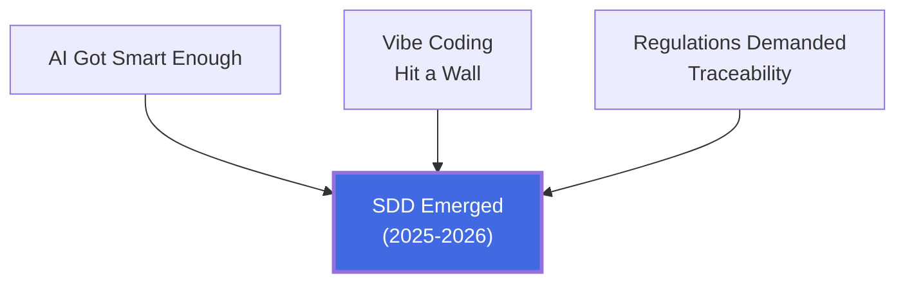

### AI Capabilities Crossed a Threshold

Large language models can now reliably generate working code from natural language specifications. Context windows grew large enough to hold detailed specs alongside code. This isn't about replacing developers — it's about amplifying effectiveness by automating the mechanical translation from specification to implementation. [2, 4, 11]

### The Vibe Coding Problem

As AI coding tools proliferated, "vibe coding" — iterative, unstructured prompting — became the dominant workflow. While great for quick prototypes, it produces brittle, unmaintainable code at scale. As Red Hat noted: *"AI coding assistants are like talented musicians, helping us build solutions quickly. But relying solely on impromptu interactions can lead to brilliant bursts of creativity mixed with brittle code."* [10] SDD emerged as the disciplined alternative. [1, 4, 10]

### Software Complexity and Compliance Pressure

Modern systems integrate dozens of services, frameworks, and dependencies. Regulatory frameworks (EU AI Act, PCI-DSS, GDPR) increasingly require traceability from requirements to implementation. SDD provides this naturally. [11, 19]

As Thoughtworks put it on their Technology Radar (placing SDD at "Assess"): *"Spec-driven development is an emerging approach to AI-assisted coding workflows"* that addresses the need for structure that vibe coding lacks. [4b]

---

## 3. The Specification Spectrum: Three Levels of Rigor

Birgitta Böckeler (Thoughtworks/Martin Fowler) identified three levels of SDD adoption that the community has widely adopted as the canonical taxonomy [3]:

> **Simple analogy:** Think of recipe cards for cooking.
> - **Spec-First** = You write a recipe, cook the meal, then toss the card. Next time you wing it.
> - **Spec-Anchored** = You keep the recipe card updated every time you tweak the dish. The card and the dish always match.
> - **Spec-as-Source** = The recipe card IS the dish. A robot chef reads it and cooks automatically. You never touch the stove — only the card.

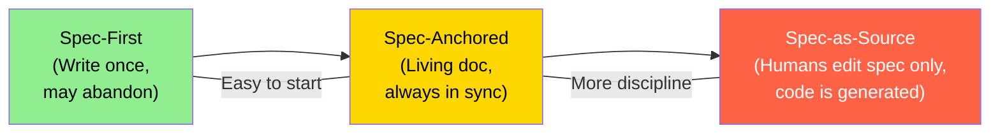

### Spec-First

A well-thought-out spec is written **before** coding to guide initial implementation. Once code exists, the spec may or may not be maintained. This is the entry point for most teams.

- **Best for:** Initial AI-assisted development, prototypes, one-off features
- **Risk:** No protection against drift over time
- **Example:** Writing a detailed PRD before asking Claude Code to implement a feature [18]

### Spec-Anchored

The spec is maintained alongside code throughout the system's lifecycle. Behavioral changes require updating **both** specs and code, with automated checks ensuring alignment.

- **Best for:** Long-lived production systems, multi-team coordination
- **How it works:** BDD scenarios or contract tests execute on every commit; divergence triggers failures
- **Example:** OpenAPI specs paired with contract testing tools like Specmatic [18]

### Spec-as-Source

The spec is the **only** artifact humans edit. Code gets entirely generated from specs and should never be manually modified. Any change requires updating the spec and regenerating.

- **Best for:** Domains with established code generation (API stubs from OpenAPI, embedded code from Simulink)
- **Emerging tool:** Tessl marks generated code with `// GENERATED FROM SPEC - DO NOT EDIT` [3]
- **Risk:** Requires very high confidence in generation quality; introduces LLM non-determinism [3, 18]

As the arXiv practitioner guide states: *"Use minimum specification rigor that removes ambiguity for your context."* [18]

---

## 4. The Four-Phase SDD Workflow

Across all major tools and definitions, SDD follows a consistent four-phase workflow [1, 2, 5, 6, 8, 18]:

> **Simple analogy:** Building a house.
> 1. **Specify** = Describe your dream house to the architect ("3 bedrooms, big kitchen, garden view")
> 2. **Plan** = Architect draws blueprints with exact measurements, materials, wiring
> 3. **Tasks** = Break the build into steps: "pour foundation," "frame walls," "install plumbing"
> 4. **Implement** = Construction crew builds it step by step, you inspect each stage

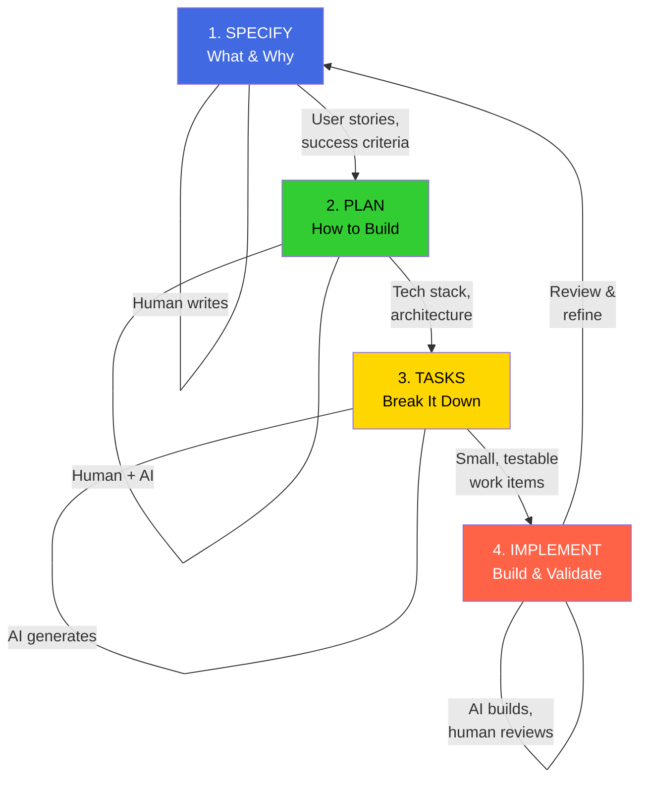

### Phase 1: Specify — "What should the software do?"

You provide a high-level description of what you're building and why. The coding agent generates a detailed specification focused on:

- **User journeys and experiences** — not technical stacks
- **Success criteria** — measurable outcomes
- **Acceptance criteria** — Given/When/Then or input-output examples
- **Edge cases and constraints** — including what NOT to build
- **Explicit constraints** — "Do NOT implement push notifications (Phase 2)"

The spec template forces separation of **what** from **how**. As GitHub's spec-driven.md states: *"Focus on WHAT users need and WHY. Avoid HOW to implement (no tech stack, APIs, code structure)."* [2]

### Phase 2: Plan — "How should we build it?"

Now you get technical. Given the functional spec, this phase produces:

- Technology choices and frameworks
- Component architecture and boundaries
- Data models and schemas
- API contracts and interfaces
- Non-functional requirements (performance, security, scalability)

The plan bridges "what" and "how." It encodes constraints implementations must respect. When using AI agents, plans provide crucial context: the AI learns not just what to build but how systems are structured and what conventions apply. [1, 5, 18]

### Phase 3: Tasks — "What are the specific work items?"

The coding agent takes the spec and plan and breaks them into **small, reviewable, independently testable chunks**:

- Each task solves a specific piece of the puzzle
- Tasks can be implemented and tested in isolation
- Instead of "build authentication," you get "create a user registration endpoint that validates email format"
- Tasks are like a test-driven development process for AI agents [1, 5]

GitHub Spec Kit marks independent tasks with `[P]` for parallelization and outlines safe parallel groups. [2]

### Phase 4: Implement — "Build it, validate it"

The coding agent tackles tasks one by one (or in parallel). The key difference from vibe coding:

- The agent **knows what** to build (spec told it)
- The agent **knows how** to build it (plan told it)
- The agent **knows exactly what to work on** (task told it)
- You review **focused changes**, not thousand-line code dumps [1]

**Crucially, your role isn't just to steer — it's to verify.** At each phase, you reflect and refine. The process builds in explicit checkpoints for you to critique, spot gaps, and course correct before moving forward. [1, 5]

---

## 5. What Makes a Good Spec

Drawing from across all sources, the consensus on effective specifications:

> **Simple analogy:** A good spec is like a good pizza order. "Make me something tasty" is vibe coding — you might get anchovies. "Large thin crust, pepperoni, extra cheese, no olives" is SDD — you get exactly what you want.

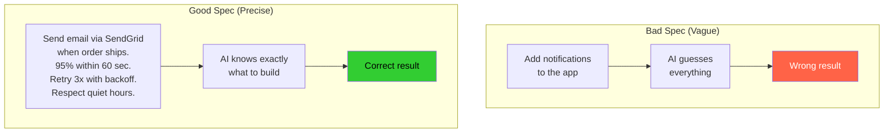

### Structure and Content

- **Behavior-focused:** Describe what happens, not how
- **Testable:** Every requirement should be verifiable
- **Unambiguous:** Different readers should arrive at the same interpretation
- **Complete enough:** Cover essential cases without over-specification
- **Domain-oriented:** Use ubiquitous language meaningful to both developers and stakeholders [4, 18]

### Format

Most teams use **Markdown** — it's easy to read in IDEs, renders nicely on GitHub, and both humans and agents can parse it. As Patrick Debois (Tessl) noted: *"The reality? This is all a form of prompt engineering. Specs are sensitive to the models being used."* [9]

The ecosystem includes many format approaches: Cursor rules, EARS format (Kiro), Speclang (GitHub Next), BMAD patterns, Agents.md conventions, and Claude Skills. There is no standard yet. [9]

### Separation of Concerns

A recurring theme: **separate functional specs from technical specs.** The aspiration is that you could swap tech stacks with the same functional spec. In practice, this boundary is hard to maintain. As Böckeler observed: *"I frequently got confused about when to stay on the functional level, and when it was time to add technical details."* [3]

### Anti-Patterns

- **Over-specification:** If specs read like pseudo-code, you've over-constrained. Separate "what" from "how" [18]
- **Markdown madness:** SDD can produce too much text. Developers spend most time reading long Markdown files hunting for basic mistakes [13]
- **Specification rot:** Specs that drift from reality lose all value. Enforce alignment through automated tests [18]
- **False confidence:** Passing spec tests doesn't guarantee correct software — only that software matches specs. If specs are wrong, code faithfully implements incorrectly [18]

---

## 6. The Constitutional Foundation

A distinctive feature of SDD (particularly in GitHub Spec Kit) is the **constitution** — a set of immutable principles governing how specs become code. [2, 5, 19]

### What It Is

> **Simple analogy:** A constitution in SDD is like the rules of a school. Individual teachers (specs) can decide what to teach each day, but EVERY teacher must follow the school rules — no phones in class, wear uniforms, be respectful. Similarly, every spec must follow the project's constitution — always write tests first, never hardcode passwords, keep it simple.

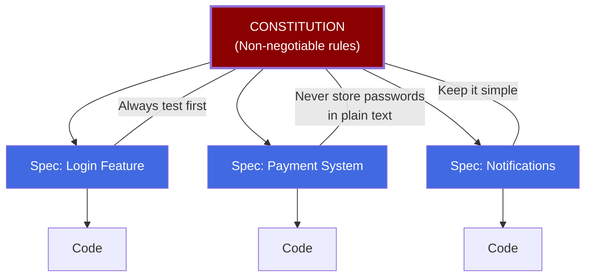

The constitution (`constitution.md`) acts as the architectural DNA of the system. It contains non-negotiable principles that every spec and implementation must respect. Think of it as a powerful rules file that shapes every aspect of development. [2, 3]

GitHub Spec Kit defines **nine articles** covering principles like:
- **Library-First:** Every feature begins as a standalone library
- **Test-First Imperative:** No code before tests (non-negotiable)
- **Simplicity:** Maximum 3 projects for initial implementation
- **Anti-Abstraction:** Use frameworks directly, don't wrap them
- **Integration-First Testing:** Prefer real databases over mocks [2]

### Constitutional Enforcement

Templates operationalize constitutional articles through concrete checkpoints — "Phase -1 Gates" that must pass before implementation begins:

```
Simplicity Gate (Article VII):
- [ ] Using ≤3 projects?
- [ ] No future-proofing?

Anti-Abstraction Gate (Article VIII):
- [ ] Using framework directly?
- [ ] Single model representation?
```

These gates prevent over-engineering by making the LLM explicitly justify complexity. [2]

### Constitutional SDD for Security

The arXiv paper on Constitutional SDD [19] extends this concept specifically to security. By embedding CWE/MITRE-mapped security principles (e.g., "Database queries MUST use parameterized statements exclusively"), they demonstrated a **73% reduction in security defects** compared to unconstrained AI generation while maintaining developer velocity. The constitution transforms security from a reactive verification activity to a **proactive generation constraint**. [19]

---

## 7. Tools and Frameworks

> **Simple analogy:** SDD tools are like different brands of GPS navigation. They all help you get from A to B (from idea to working software), but they have different interfaces, different levels of detail, and work better for different kinds of trips.

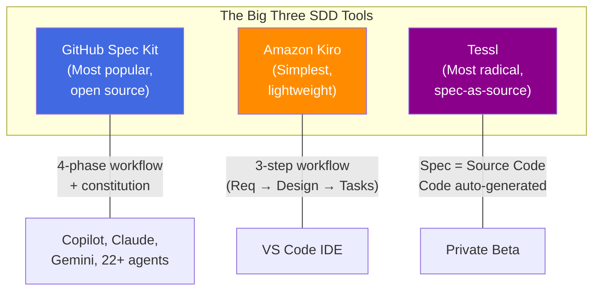

### GitHub Spec Kit

The most prominent open-source SDD toolkit. [1, 2, 5]

- **Distribution:** CLI (`uvx --from git+https://github.com/github/spec-kit.git specify init`)
- **Workflow:** Constitution → Specify → Plan → Tasks → Implement
- **Commands:** `/speckit.specify`, `/speckit.plan`, `/speckit.tasks`
- **Key feature:** Cross-agent (works with Copilot, Claude Code, Gemini CLI, and 22+ platforms)
- **File topology:** Constitution in `memory/`, templates in `templates/`, specs in per-feature folders with up to 8 files each
- **Status:** Experimental, 72.7k+ stars as of Feb 2026 [11]

### Amazon Kiro

The simplest/most lightweight SDD tool. [3, 12]

- **Distribution:** VS Code-based IDE
- **Workflow:** Requirements → Design → Tasks (3 markdown files)
- **Key feature:** Built-in "steering" (memory bank) with `product.md`, `tech.md`, `structure.md`
- **Philosophy:** Draws from Amazon's "working backwards" culture and formal specification practices (TLA+, P language) [12]
- **Limitation:** Primarily spec-first; no clear strategy for spec maintenance over time [3]

### Tessl Framework

The most radical approach — pursuing spec-as-source. [3, 9]

- **Status:** Private beta
- **Key feature:** 1:1 mapping between spec files and code files; code marked `// GENERATED FROM SPEC - DO NOT EDIT`
- **Approach:** Specs can be reverse-engineered from existing code (`tessl document --code ...js`); tags like `@generate` or `@test` control what gets generated
- **Vision:** Spec registries (like npm/PyPI for specs) for reusable patterns [9]

### Other Tools Mentioned in Community

- **Agent OS** (builder methods) — structured agent workflows [16]
- **BMAD Method** — another spec-driven framework [13]
- **Autospec** — community tool for Claude Code users [16]
- **Devplan** — external spec storage with parallel agent execution [16]
- **Traycer** — SDD orchestration tool [17]

### BDD and API Spec Tools (Pre-AI Foundations)

| Category | Examples | Role in SDD |
|----------|----------|-------------|
| BDD Frameworks | Cucumber, SpecFlow, Behave | Executable specs in Gherkin |
| API Specification | OpenAPI/Swagger, GraphQL SDL, Protobuf | Define contracts; generate code/tests |
| Contract Testing | Pact, Specmatic | Verify implementations match specs |
| Model-Based | Simulink, SCADE | Visual specs generating embedded code |

Source: [18]

---

## 8. SDD vs. TDD, BDD, and Vibe Coding

> **Simple analogy:** Think of different ways to write an essay.
> - **TDD (Test-Driven)** = Write the grading rubric first, then write the essay to pass it
> - **BDD (Behavior-Driven)** = Write example sentences ("Given a topic, When I write 3 paragraphs, Then the teacher is happy"), then write to match
> - **Vibe Coding** = Just start writing stream-of-consciousness and hope for the best
> - **SDD** = Write a detailed outline with sections, key points, and success criteria, then have AI write the essay for you

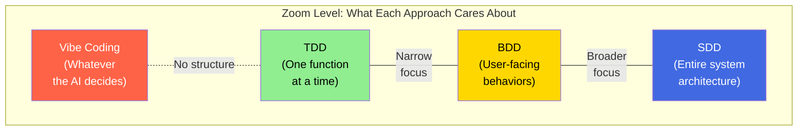

| Dimension | TDD | BDD | Vibe Coding | SDD |
|-----------|-----|-----|-------------|-----|
| **Primary artifact** | Unit tests | Given-When-Then scenarios | Natural language prompts | Executable specifications |
| **Scope** | Individual function | Cross-functional behavior | Full application | System-wide architectural contracts |
| **Validation** | Automated test suites | Human-referenced docs | Manual review (if any) | Build fails on spec divergence |
| **AI governance** | None built-in | None built-in | None built-in | Constitutional constraints + checkpoints |

Source: [11]

### Key Relationships

- **TDD** is SDD at the unit level. Writing tests first = writing micro-specifications. SDD extends this to features, systems, and architectures [18]
- **BDD** is SDD's most direct ancestor. Gherkin scenarios are executable specs. What AI-assisted SDD adds is code generation from those specs [18]
- **Vibe Coding** is SDD's antithesis. Academic research shows AI-assisted coding with tools like Cursor increases code complexity by ~41% and static analysis warnings by ~30% without structured approaches [11]
- **MDD (Model-Driven Development)** is an important historical parallel. Böckeler warns: *"I wonder if spec-as-source might end up with the downsides of both MDD and LLMs: inflexibility AND non-determinism."* [3]

As one arXiv paper put it: *"SDD is not a revolution… it's just BDD with branding. But the branding serves a purpose: it reminds practitioners that specifications should be authoritative rather than advisory."* [18]

---

## 9. Real-World Practitioner Experiences

### Positive Reports

**Heeki Park** (solutions architect, using Claude Code) spent extensive time in the planning phase writing specs before implementation, and found: *"Time spent in upfront planning pays dividends for implementation efficiency and output quality."* His follow-up interactions were small tweaks rather than wholesale changes. Key advice: build stepwise in small, testable chunks, and regularly revisit specs. [7]

**Reddit user u/Thin_Beat_9072:** *"You can spend a couple of days making specs... Building takes less than 10 minutes while it takes days to spec out all the details. You would debug the blueprint not the actual app."* [16]

**Reddit user u/MXBT9W9QX96:** *"I use it and swear by it. I'm having too much success using it to go back to not using it."* [16]

**Reddit user u/Actual-Interest-2365:** Described a detailed iterative SDD workflow: update spec → tell AI to implement the diff → repeat. Generated 6,000 LOC with only 3 known bugs, calling it *"insanely good quality, which I could never have achieved as a senior developer."* [17]

### Mixed Experiences

**u/funbike** shared a Gherkin-based SDD workflow: Idea → User Stories → Gherkin → Schema → Functional Tests → Code, noting it *"sounds like a lot, but I have a `prompts/` directory that makes this easy."* [16]

**Daniel Sogl** (Dev.to) tried Spec Kit for an Angular Pokedex app. While SDD showed promise, he concluded: *"The main problem isn't the AI — it's the human factor. SDD requires developers to specify their intentions precisely, which is exactly where the model faces its greatest challenge."* [15]

**u/JaySym_ (Reddit):** *"Helpful as structure, bad as ideology. The useful version is keeping a living artifact for what the task is supposed to do... If you treat the spec like a frozen contract, it falls apart fast."* [17]

### Critical Voices

Many experienced developers on Reddit noted SDD is essentially rediscovering traditional requirements engineering:

**u/Exotic-Sale-3003:** *"Yes, people who build software for a living have long realized having requirements before you start is helpful."* [16]

**u/trafalmadorianistic:** *"No way! You mean writing down what you want to create, in great detail, actually results in better output?"* [16]

---

## 10. Critiques and Limitations

> **Why people argue about SDD:** The debate boils down to one question — is it better to plan everything carefully first (like studying for weeks before a test) or learn by doing (like jumping in the pool to learn to swim)? Both sides have good points, and the truth is probably somewhere in the middle.

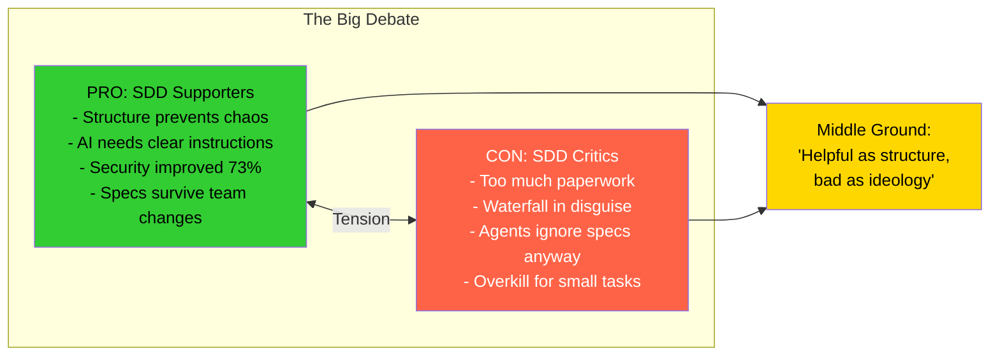

### The Waterfall Critique

The most prominent critique comes from **Marmelab** [13], arguing SDD is "waterfall in disguise":

- **Big Design Up Front** piles up hypotheses in a fundamentally non-deterministic process
- SDD requires being **both** a business analyst (to catch requirements errors) **and** a developer (to catch design errors)
- Agile methodologies solved non-determinism by trading predictability for adaptability
- Marmelab's alternative: "Natural Language Development" — iterative, Lean Startup-inspired approach. They built a 3D sculpting tool in ~10 hours with Claude Code using no spec at all [13]

### Thoughtworks' Assessment

Liu Shangqi (Thoughtworks) pushes back on the waterfall comparison: *"The problems we currently encounter with AI coding are different — they stem from the fact that vibe coding is too fast, spontaneous and haphazard... SDD is not creating huge feedback loops like waterfall — it's providing a mechanism for shorter and effective ones."* [4]

### Böckeler's Observations (Martin Fowler)

The most thorough technical critique [3]:

1. **One workflow doesn't fit all sizes:** Using SDD for a small bug fix is "like using a sledgehammer to crack a nut." Kiro turned a small bug into 4 user stories with 16 acceptance criteria
2. **Reviewing Markdown over code:** Spec Kit created many verbose, repetitive files. *"I'd rather review code than all these markdown files"*
3. **False sense of control:** *"Even with all these files and templates, I frequently saw the agent not follow all the instructions."* The agent ignored research notes and created duplicates
4. **Workflow-size mismatch:** Available tutorials focus on greenfield; integrating SDD into existing codebases is much harder
5. **Target user confusion:** SDD demos incorporate product management tasks (user stories, feature goals) but present them as developer work

### Thoughtworks Radar Concerns

The Technology Radar identified additional risks [4b]:
- Tools behave differently depending on task size and type
- Generated spec files can be difficult to review
- Risk of relearning the **"bitter lesson"** — handcrafting detailed rules for AI may not scale effectively

### Community Pushback

**u/please-dont-deploy (Reddit):** Raised five concerns: (a) SDD sounds like a silver bullet, (b) LLMs are non-deterministic so enforcement fails, (c) you still need all SDLC infrastructure, (d) specs get outdated, (e) nothing prevents spec 1 from contradicting spec 50 [17]

**u/casamia123 (Reddit):** *"SDD iterates on the spec, not on the whole process... there's no structured retrospective, no mechanism for the process itself to learn and evolve."* [17]

---

## 11. When to Use SDD (and When Not To)

> **Simple decision guide:** Ask yourself — "Would I regret NOT having a blueprint?" If yes, use SDD. If it's a quick sketch on a napkin kind of project, skip it.

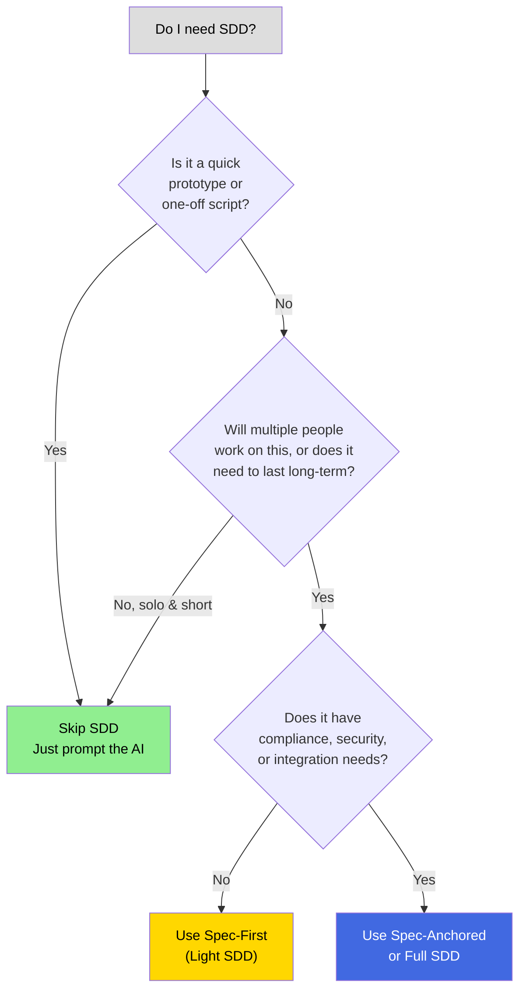

### SDD Adds Clear Value When:

| Scenario | Why SDD Helps |
|----------|---------------|
| Using AI coding assistants | Removes ambiguity that forces AI to guess [18] |
| Complex requirements | Stakeholders validate before code generation [18] |
| Multi-maintainer systems | Specs survive team turnover [18] |
| Integration-heavy systems | API specs enable parallel development [18] |
| Regulated domains | Requirements-to-implementation traceability is mandated [11, 19] |
| Legacy modernization | Extract specs from existing behavior before reimplementing [18] |
| Production features | Compliance, security, and maintainability matter [8] |

### SDD May Be Excessive When:

| Scenario | Why Skip SDD |
|----------|-------------|
| Throwaway prototypes | Spec investment gets discarded [18] |
| Solo, short-lived projects | Overhead exceeds benefits [18] |
| Exploratory coding | Premature spec constrains learning [18] |
| Simple CRUD apps | Requirements are obvious; elaborate specs add cost without value [18] |
| Quick bug fixes | A sledgehammer to crack a nut [3] |
| Small teams with frequent pivots | Spec overhead consumes disproportionate dev time [11] |
| Rapid prototyping (days to feedback) | SDD's upfront cost creates expensive regeneration cycles [11] |

### The Decision Framework

From the arXiv practitioner guide [18]:

> **Golden Rule:** Use minimum specification rigor that removes ambiguity for your context. Apply spec-first for AI-assisted initial development; spec-anchored for long-lived production systems; spec-as-source only when generation tooling is mature and trusted.

From Zencoder's practical guide [8]:

> Not every coding task needs full specification. Quick prototypes, simple utility functions, bug fixes with clear solutions, learning and exploration, one-off scripts — use traditional prompting. Production features, multi-file implementations, integration with existing systems, compliance requirements, long-running development, team consistency — use SDD.

---

## 12. Academic Research Frontiers

### SDD as Architectural Paradigm (InfoQ/Red Hat)

Griffin and Carroll argue SDD is more than a methodology — it's an **architectural pattern** introducing a five-layer execution model [14]:

> **Simple analogy:** Think of the five layers like a factory assembly line. The blueprint (spec) sits at the top. It feeds into machines (generators) that produce parts (artifacts). Quality control (validation) checks every part. Only then does the final product (runtime) get shipped.

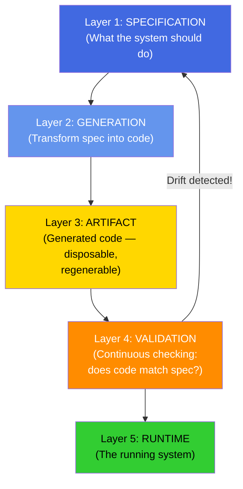

1. **Specification Layer** — declarative system intent (human-readable + machine-executable)
2. **Generation Layer** — transforms intent into executable form (multi-target compiler)
3. **Artifact Layer** — concrete outputs (generated, disposable, regenerable — "Ambient Code")
4. **Validation Layer** — continuous alignment enforcement (contract tests, schema validation, drift detection)
5. **Runtime Layer** — operationally constrained by upstream layers

They introduce the concept of **SpecOps** (Specification Operations) — five core capabilities needed: spec authoring as first-class engineering, formal validation, deterministic generation, continuous conformance, and governed evolution. [14]

### Constitutional Security (arXiv)

Marri's paper [19] demonstrates embedding CWE/MITRE-mapped security constraints in the spec layer, achieving:
- **73% reduction** in security defects vs. unconstrained AI generation
- **56% faster** time to first secure build
- **4.3x improvement** in compliance documentation coverage
- Documented four violation patterns: SQL injection, password logging, IDOR, improper input validation — all caught by constitutional constraints before reaching production

### SWE-AGI Benchmark (arXiv)

The SWE-AGI benchmark [20] evaluates end-to-end, **specification-driven construction** of software systems in MoonBit:
- 22 tasks spanning parsers, interpreters, decoders, SAT solvers (10³–10⁴ LOC each)
- Best performer: gpt-5.3-codex at 86.4% (19/22 tasks)
- **Key finding:** Code reading, not writing, becomes the dominant bottleneck as complexity grows — on hard tasks, Read actions account for 41–65% of all agent actions
- Performance degrades sharply with task difficulty, especially on specification-intensive systems

### Formal Methods SDD (Sedeve-Kit)

The Sedeve-Kit framework [21] applies classical formal methods to SDD for distributed systems:
- Three stages: TLA+ specification → guided implementation with action anchor macros → deterministic testing via trace-based validation
- Positions between full Formal Verification Frameworks (like Verdi/IronFleet) and Model-Based Testing
- Significantly less proof effort than FVF while catching spec-deviation bugs that MBT misses
- Demonstrated on the Raft consensus protocol (3,038 SLOC of TLA+ vs. Verdi's 12,511 SLOC of Coq for basic Raft)

---

## 13. The Road Ahead

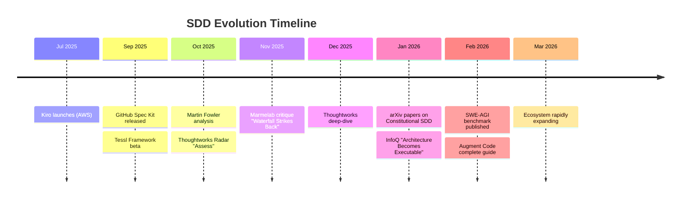

### Emerging Trends

1. **Spec registries** (like npm/PyPI for specs) are coming. Tessl and others are working on public spec sharing for common patterns like authentication, API design, and security guidelines [9]

2. **Spec evals** will emerge — metrics for evaluating spec quality (completeness, testability, maintainability) analogous to code quality tools [9]

3. **Self-spec methods** where LLMs author their own specifications before generating code, creating explicit planning-execution separation [18]

4. **Context engineering** integration — separating requirements analysis from implementation essentially compresses context into specs, a key technique for managing AI agent context windows [4]

5. **Multi-agent coordination** — specs enable parallel agent execution across non-overlapping tasks, with dependency orchestration [18]

### Open Questions

- **Who is the target user?** Is SDD for developers, product managers, or a new hybrid role? [3]
- **How to handle brownfield codebases?** Most demos are greenfield; introducing SDD into existing systems remains hard [3, 11]
- **Will "spec as source" scale?** The MDD parallel warns of inflexibility + non-determinism combining badly [3]
- **Spec consistency at scale:** How to prevent specs from contradicting each other across modules? [17]
- **Can spec quality be automated?** Without spec evals, quality depends entirely on human judgment [9]

### The Fundamental Tension

> **Simple analogy:** It's like the debate between "plan your road trip with every hotel booked in advance" vs. "just start driving and figure it out." Both work. The best travelers probably do a bit of both — plan the big stops, wing the small ones. That's where SDD is heading.

SDD sits at the intersection of two opposing forces:

**The engineering case:** Structure, discipline, and traceability are essential for production AI-generated code. As SWE-AGI shows, specification comprehension is the bottleneck, not code generation [20]. Constitutions reduce security defects by 73% [19]. Specs are the future.

**The agile case:** Heavy upfront documentation has failed before (waterfall). Software is non-deterministic. Iterative discovery with fast feedback beats planning. As Marmelab argues: *"Coding agents supercharge Agile, because we can literally write the product backlog and see it being built in real time."* [13]

The emerging consensus, captured by Reddit user u/JaySym_: **"Helpful as structure, bad as ideology."** [17]

---

## 14. Sources

### Core Introductions & Official Resources
1. GitHub Blog: "Spec-driven development with AI: Get started with a new open source toolkit" (Sep 2025) — https://github.blog/ai-and-ml/generative-ai/spec-driven-development-with-ai-get-started-with-a-new-open-source-toolkit/
2. GitHub Spec Kit `spec-driven.md` — https://github.com/github/spec-kit/blob/main/spec-driven.md
3. Martin Fowler / Birgitta Böckeler: "Understanding Spec-Driven-Development: Kiro, spec-kit, and Tessl" (Oct 2025) — https://martinfowler.com/articles/exploring-gen-ai/sdd-3-tools.html
4. Thoughtworks: "Spec-driven development: Unpacking one of 2025's key new AI-assisted engineering practices" (Dec 2025) — https://www.thoughtworks.com/en-us/insights/blog/agile-engineering-practices/spec-driven-development-unpacking-2025-new-engineering-practices
4b. Thoughtworks Technology Radar: Spec-driven development (Nov 2025) — https://www.thoughtworks.com/en-us/radar/techniques/spec-driven-development
5. Microsoft Developer Blog: "Diving Into Spec-Driven Development With GitHub Spec Kit" (Sep 2025) — https://developer.microsoft.com/blog/spec-driven-development-spec-kit
6. Wikipedia: Spec-driven development — https://en.wikipedia.org/wiki/Spec-driven_development

### Practical Guides & Tool-Specific Articles
7. Heeki Park: "Using spec-driven development with Claude Code" (Mar 2026) — https://heeki.medium.com/using-spec-driven-development-with-claude-code-4a1ebe5d9f29
8. Zencoder: "A Practical Guide to Spec-Driven Development" — https://docs.zencoder.ai/user-guides/tutorials/spec-driven-development-guide
9. Patrick Debois / Tessl: "Spec-Driven Development: 10 things you need to know about specs" (Oct 2025) — https://tessl.io/blog/spec-driven-development-10-things-you-need-to-know-about-specs/
10. Red Hat Developers: "How spec-driven development improves AI coding quality" (Oct 2025) — https://developers.redhat.com/articles/2025/10/22/how-spec-driven-development-improves-ai-coding-quality
11. Augment Code: "What Is Spec-Driven Development? A Complete Guide" (Feb 2026) — https://www.augmentcode.com/guides/what-is-spec-driven-development
12. Kiro Blog: "Kiro and the future of AI spec-driven software development" (Jul 2025) — https://kiro.dev/blog/kiro-and-the-future-of-software-development/

### Critical / Balanced Takes & Discussions
13. Marmelab: "Spec-Driven Development: The Waterfall Strikes Back" (Nov 2025) — https://marmelab.com/blog/2025/11/12/spec-driven-development-waterfall-strikes-back.html
14. InfoQ / Red Hat: "Spec Driven Development: When Architecture Becomes Executable" (Jan 2026) — https://www.infoq.com/articles/spec-driven-development/
15. Daniel Sogl / Dev.to: "Spec Driven Development (SDD) – A initial review" (Sep 2025) — https://dev.to/danielsogl/spec-driven-development-sdd-a-initial-review-2llp
16. Reddit r/ChatGPTCoding: "Does anyone use spec-driven development?" — https://www.reddit.com/r/ChatGPTCoding/comments/1otf3xc/
17. Reddit r/ClaudeCode: "Has anyone tried the spec driven development?" — https://www.reddit.com/r/ClaudeCode/comments/1rg0b9i/

### Academic Papers
18. Piskala, D.B. "Spec-Driven Development: From Code to Contract in the Age of AI Coding Assistants" (Jan 2026) — https://arxiv.org/abs/2602.00180
19. Marri, S.R. "Constitutional Spec-Driven Development: Enforcing Security by Construction in AI-Assisted Code Generation" (Jan 2026) — https://arxiv.org/abs/2602.02584
20. Zhang et al. "SWE-AGI: Benchmarking Specification-Driven Software Construction with MoonBit" (Feb 2026) — https://arxiv.org/abs/2602.09447
21. Guo et al. "Sedeve-Kit: A Specification-Driven Development Framework for Building Distributed Systems" (Sep 2025) — https://arxiv.org/abs/2509.11566
