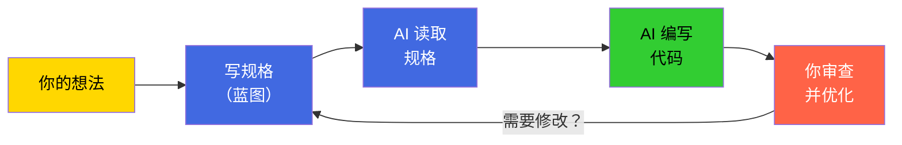
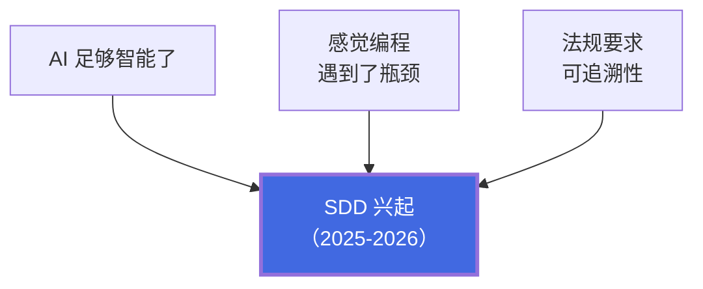
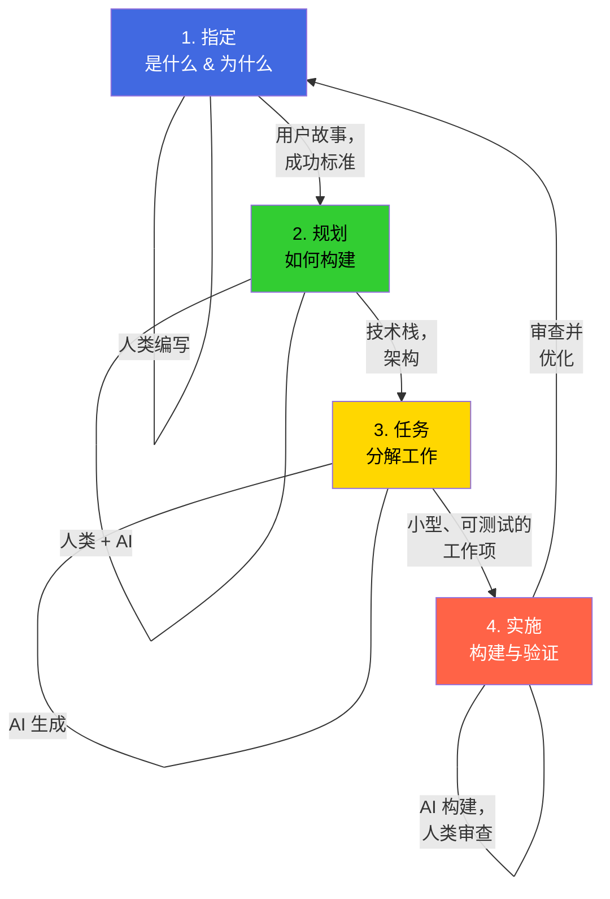
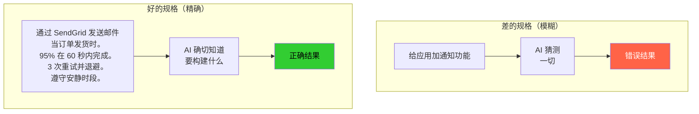
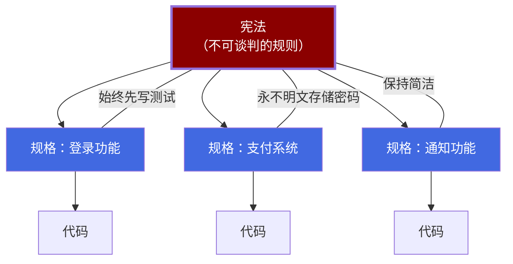
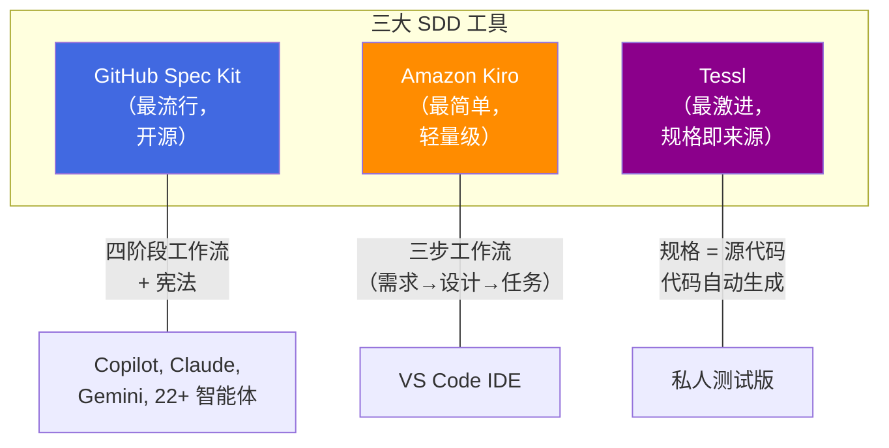
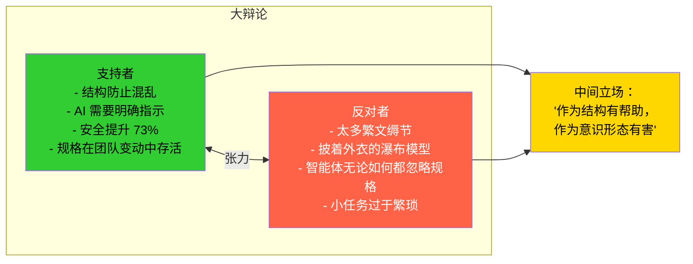
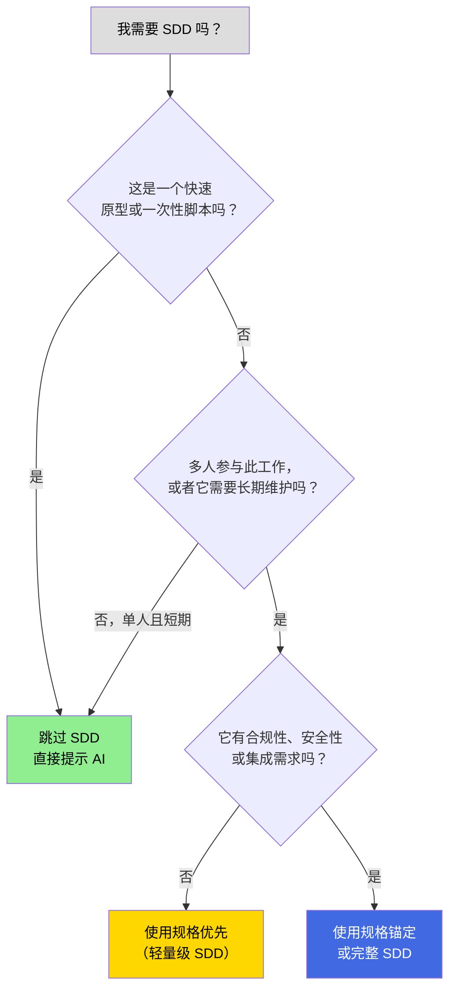
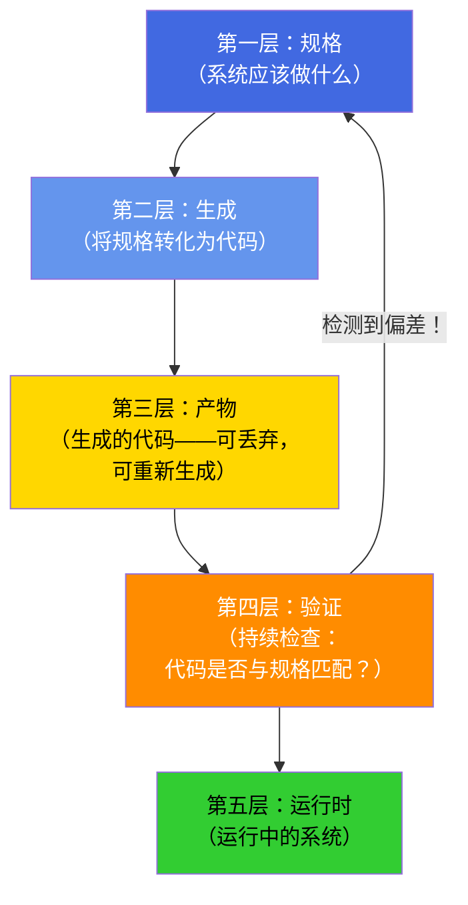
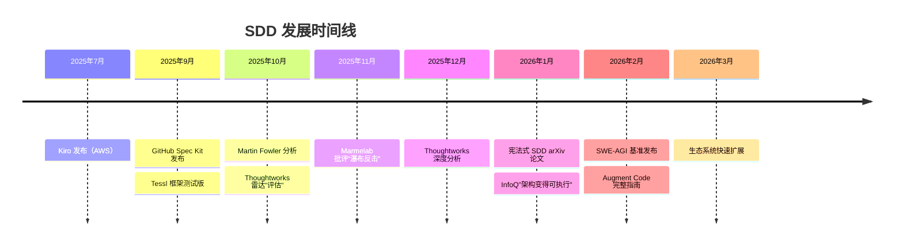

# 规格驱动开发（SDD）综合指南

> *综合 22 个来源——博客文章、行业分析、实践者指南、学术论文和社区讨论——涵盖 AI 编程智能体时代新兴的规格驱动开发（Spec-Driven Development）学科（2025–2026）。*

---

## 太长不看版 —— 像高中生一样理解它

想象你要建一个树屋，有两种选择：

**选项 A（感觉编程 / Vibe Coding）：** 你拿起木头和钉子，开始敲，边做边想。起初可能看起来不错，但地板不平，门装不上，下雨漏水。

**选项 B（规格驱动开发）：** 在你碰任何一块木头之前，先画好详细的蓝图——每面墙多大、门开在哪里、屋顶什么样。然后把这些蓝图交给一个超快的机器人木匠（AI），它会严格按照蓝图来建造。

**SDD 就是软件领域的选项 B。** 你先写一份详细的"蓝图"（称为*规格*或 *spec*），然后让 AI 编程工具根据这份蓝图生成实际代码。蓝图才是最重要的——不是代码。如果你想改动什么，就改蓝图，让 AI 重新构建。



---

## 目录

1. [什么是规格驱动开发？](#1-什么是规格驱动开发)
2. [SDD 为何在此时兴起](#2-sdd-为何在此时兴起)
3. [规格谱系：三个严谨度级别](#3-规格谱系三个严谨度级别)
4. [四阶段 SDD 工作流](#4-四阶段-sdd-工作流)
5. [什么是好的规格](#5-什么是好的规格)
6. [宪法基础](#6-宪法基础)
7. [工具与框架](#7-工具与框架)
8. [SDD 与 TDD、BDD 和感觉编程的比较](#8-sdd-与-tdd-bdd-和感觉编程的比较)
9. [实践者的真实经验](#9-实践者的真实经验)
10. [批评与局限性](#10-批评与局限性)
11. [何时使用 SDD（何时不用）](#11-何时使用-sdd-何时不用)
12. [学术研究前沿](#12-学术研究前沿)
13. [未来展望](#13-未来展望)
14. [参考来源](#14-参考来源)

---

## 1. 什么是规格驱动开发？

规格驱动开发（SDD）是一种软件工程方法论，其中**规格——而非代码——是开发的核心产物**。团队不再是先编码再写文档，而是先编写详细的结构化规格，再使用 AI 编程智能体根据这些规格生成、规划和实现代码。

正如 GitHub 的奠基文档所言：*"在这个新世界中，维护软件意味着演进规格。开发的通用语言上升到更高层次，代码只是最后一公里的实现手段。"* [2]

维基百科的正式定义：SDD 是*"一种软件工程方法论，其中正式的、机器可读的规格作为权威的真相来源，以及从中派生实现、测试和文档的主要产物。"* [6]

核心洞察很简单：AI 编程智能体擅长模式补全，但在未说明的需求上容易出错。像"给我的应用加上照片分享功能"这样的模糊提示，会迫使 AI 猜测格式、权限、存储和压缩方式——每一次猜测都带来风险。这就是从业者所说的**"感觉编程（Vibe Coding）"**。为 AI 提供明确、结构化的规格，能显著提升输出质量。[1, 18]

### 权力的倒转

几十年来，代码是王者。规格服务于代码——它们是我们搭建并在"真正工作"开始后就丢弃的脚手架。SDD 颠覆了这种权力结构：**规格不再服务于代码——代码服务于规格。** 产品需求文档不是实现的指南，而是生成实现的来源。[2]

> **简单类比：** 把它想象成音乐。在旧世界，*录音*（代码）是产品，*乐谱*（规格）只是粗略的指引。在 SDD 中，*乐谱*成为真正的产品——任何音乐家（或 AI）都可以演奏它来制作录音。如果你想改歌，就改乐谱，不是录音。


这种颠覆之所以成为可能，是因为 AI 现在可以理解并实现复杂的规格。但没有结构的原始 AI 生成只会产生混乱。SDD 通过足够精确和完整的规格提供了这种结构，从而生成可工作的系统。[2]

---

## 2. SDD 为何在此时兴起

三股汇聚的力量使 SDD 在 2025–2026 年不仅成为可能，更成为必要：



### AI 能力跨越了门槛

大型语言模型现在可以可靠地从自然语言规格生成可工作的代码。上下文窗口足够大，可以同时容纳详细的规格和代码。这不是关于取代开发者——而是通过自动化从规格到实现的机械翻译来放大效率。[2, 4, 11]

### 感觉编程的问题

随着 AI 编程工具的普及，"感觉编程"——迭代式、无结构的提示——成为主流工作流。虽然非常适合快速原型，但在规模化时会产生脆弱、难以维护的代码。正如 Red Hat 所指出的：*"AI 编程助手就像才华横溢的音乐家，帮助我们快速构建解决方案。但仅仅依赖即兴互动可能会导致创意迸发的同时产生脆弱的代码。"* [10] SDD 作为有纪律的替代方案而兴起。[1, 4, 10]

### 软件复杂性和合规压力

现代系统集成了数十个服务、框架和依赖项。监管框架（欧盟 AI 法案、PCI-DSS、GDPR）越来越要求从需求到实现的可追溯性。SDD 自然地提供了这一点。[11, 19]

正如 Thoughtworks 在其技术雷达中所说（将 SDD 列为"评估"级别）：*"规格驱动开发是 AI 辅助编程工作流的新兴方法"*，它解决了感觉编程所缺乏的结构问题。[4b]

---

## 3. 规格谱系：三个严谨度级别

Birgitta Böckeler（Thoughtworks/Martin Fowler）确定了三个 SDD 采用级别，社区已广泛采用这一分类法作为标准分类 [3]：

> **简单类比：** 把它想象成烹饪的食谱卡片。
> - **规格优先** = 你先写一份食谱，做好饭，然后把卡片扔掉。下次就随机发挥了。
> - **规格锚定** = 每次调整菜品时你都更新食谱卡片。卡片和菜品始终匹配。
> - **规格即来源** = 食谱卡片就是菜品本身。机器人厨师读取它然后自动烹饪。你从不碰炉子——只碰卡片。


### 规格优先（Spec-First）

在编码**之前**编写经过深思熟虑的规格以指导初始实现。代码存在后，规格可能维护也可能不维护。这是大多数团队的入口点。

- **最适合：** 初始 AI 辅助开发、原型、一次性功能
- **风险：** 无法防止随时间推移的漂移
- **示例：** 在要求 Claude Code 实现功能之前编写详细的 PRD [18]

### 规格锚定（Spec-Anchored）

在系统整个生命周期中，规格与代码并行维护。行为变更需要**同时**更新规格和代码，通过自动化检查确保对齐。

- **最适合：** 长期生产系统、多团队协调
- **工作方式：** BDD 场景或合同测试在每次提交时执行；偏差触发失败
- **示例：** 与 Specmatic 等合同测试工具配对的 OpenAPI 规格 [18]

### 规格即来源（Spec-as-Source）

规格是**唯一**人类编辑的产物。代码完全从规格生成，不应手动修改。任何更改都需要更新规格并重新生成。

- **最适合：** 代码生成成熟的领域（来自 OpenAPI 的 API 存根、来自 Simulink 的嵌入式代码）
- **新兴工具：** Tessl 用 `// GENERATED FROM SPEC - DO NOT EDIT` 标记生成的代码 [3]
- **风险：** 需要对生成质量高度信任；引入 LLM 不确定性 [3, 18]

正如 arXiv 实践者指南所言：*"在你的上下文中，使用能消除歧义的最低规格严谨度。"* [18]

---

## 4. 四阶段 SDD 工作流

在所有主要工具和定义中，SDD 遵循一致的四阶段工作流 [1, 2, 5, 6, 8, 18]：

> **简单类比：** 建造房屋。
> 1. **指定** = 向建筑师描述你梦想中的房子（"3 间卧室，大厨房，花园景观"）
> 2. **规划** = 建筑师绘制带有精确尺寸、材料、布线的蓝图
> 3. **任务** = 将建造分解为步骤："浇筑地基"、"搭建墙框"、"安装管道"
> 4. **实施** = 施工队逐步建造，你检查每个阶段



### 第一阶段：指定——"软件应该做什么？"

你提供你正在构建的内容和原因的高层描述。编程智能体生成一份详细规格，重点关注：

- **用户旅程和体验** —— 而非技术栈
- **成功标准** —— 可衡量的结果
- **验收标准** —— Given/When/Then 或输入输出示例
- **边界情况和约束** —— 包括**不**构建什么
- **明确约束** —— "不要实施推送通知（第二阶段）"

规格模板强制分离**是什么**和**怎么做**。正如 GitHub 的 spec-driven.md 所述：*"专注于用户需要什么以及为什么。避免如何实现（无技术栈、API、代码结构）。"* [2]

### 第二阶段：规划——"我们应该如何构建它？"

现在进入技术层面。根据功能规格，此阶段产出：

- 技术选择和框架
- 组件架构和边界
- 数据模型和模式
- API 合同和接口
- 非功能需求（性能、安全、可扩展性）

规划连接"是什么"和"怎么做"。它编码了实现必须遵守的约束。在使用 AI 智能体时，规划提供了关键上下文：AI 不仅了解要构建什么，还了解系统如何构建以及适用哪些约定。[1, 5, 18]

### 第三阶段：任务——"具体的工作项是什么？"

编程智能体获取规格和规划，并将其分解为**小型、可审查、可独立测试的块**：

- 每个任务解决一个特定问题
- 任务可以独立实施和测试
- 不是"构建身份验证"，而是"创建一个验证电子邮件格式的用户注册端点"
- 任务就像 AI 智能体的测试驱动开发流程 [1, 5]

GitHub Spec Kit 用 `[P]` 标记独立任务以便并行化，并概述安全的并行组。[2]

### 第四阶段：实施——"构建它，验证它"

编程智能体逐一（或并行）处理任务。与感觉编程的关键区别：

- 智能体**知道要构建什么**（规格告诉它）
- 智能体**知道如何构建**（规划告诉它）
- 智能体**知道具体要做什么**（任务告诉它）
- 你审查**聚焦的变更**，而不是千行的代码转储 [1]

**关键是，你的角色不仅仅是引导——而是验证。** 在每个阶段，你都要反思和优化。该流程内置了明确的检查点，让你在继续之前批判、发现缺口并纠偏。[1, 5]

---

## 5. 什么是好的规格

综合所有来源，关于有效规格的共识：

> **简单类比：** 好的规格就像好的披萨订单。"给我做点好吃的"是感觉编程——你可能会得到凤尾鱼。"大号薄底，意大利辣香肠，多加奶酪，不要橄榄"是 SDD——你得到的正是你想要的。



### 结构与内容

- **以行为为中心：** 描述发生什么，而非如何做
- **可测试：** 每个需求都应该可验证
- **无歧义：** 不同读者应该得出相同的解释
- **足够完整：** 覆盖必要案例而不过度规格化
- **面向领域：** 使用对开发者和利益相关者都有意义的通用语言 [4, 18]

### 格式

大多数团队使用 **Markdown**——在 IDE 中易于阅读，在 GitHub 上渲染良好，人类和智能体都可以解析。正如 Patrick Debois（Tessl）所指出的：*"现实？这一切都是提示工程的一种形式。规格对所使用的模型很敏感。"* [9]

生态系统包含许多格式方法：Cursor rules、EARS 格式（Kiro）、Speclang（GitHub Next）、BMAD 模式、Agents.md 约定和 Claude Skills。目前尚无标准。[9]

### 关注点分离

一个反复出现的主题：**将功能规格与技术规格分开。** 理想是你可以用相同的功能规格更换技术栈。实际上，这个边界很难维护。正如 Böckeler 所观察到的：*"我经常困惑于何时停留在功能层面，何时是添加技术细节的时候。"* [3]

### 反模式

- **过度规格化：** 如果规格读起来像伪代码，你已经过度约束了。将"是什么"与"怎么做"分开 [18]
- **Markdown 疯狂：** SDD 可能产生太多文本。开发者花大量时间阅读长 Markdown 文件，寻找基本错误 [13]
- **规格腐烂：** 与现实偏离的规格会失去所有价值。通过自动化测试强制对齐 [18]
- **虚假信心：** 通过规格测试不保证正确的软件——只保证软件与规格匹配。如果规格是错的，代码会忠实地实现错误 [18]

---

## 6. 宪法基础

SDD 的一个显著特征（特别是在 GitHub Spec Kit 中）是**宪法**——一套管理规格如何转化为代码的不可变原则。[2, 5, 19]

### 什么是宪法

> **简单类比：** SDD 中的宪法就像学校的规章制度。个别老师（规格）可以决定每天教什么，但每位老师都必须遵守学校规则——课堂上不许用手机、穿校服、保持尊重。同样，每个规格都必须遵守项目的宪法——始终先写测试、永不硬编码密码、保持简洁。



宪法（`constitution.md`）充当系统的架构 DNA。它包含每个规格和实现都必须遵守的不可谈判的原则。把它想象成一个强大的规则文件，塑造开发的每个方面。[2, 3]

GitHub Spec Kit 定义了**九条条款**，涵盖以下原则：
- **库优先：** 每个功能都从独立库开始
- **测试优先命令：** 无测试则无代码（不可谈判）
- **简洁性：** 初始实现最多 3 个项目
- **反抽象：** 直接使用框架，不要封装它们
- **集成优先测试：** 优先使用真实数据库而非模拟 [2]

### 宪法执行

模板通过具体检查点使宪法条款得以落实——在实施开始之前必须通过的"阶段 -1 门控"：

```
简洁性门控（第七条）：
- [ ] 使用 ≤3 个项目？
- [ ] 没有面向未来的过度设计？

反抽象门控（第八条）：
- [ ] 直接使用框架？
- [ ] 单一模型表示？
```

这些门控通过让 LLM 明确说明复杂性的理由来防止过度工程化。[2]

### 用于安全的宪法式 SDD

arXiv 关于宪法式 SDD 的论文 [19] 专门将这一概念扩展到安全领域。通过在规格层嵌入 CWE/MITRE 映射的安全原则（例如，"数据库查询必须独家使用参数化语句"），他们展示了与不受约束的 AI 生成相比**安全缺陷减少 73%**，同时保持了开发者效率。宪法将安全从被动验证活动转变为**主动生成约束**。[19]

---

## 7. 工具与框架

> **简单类比：** SDD 工具就像不同品牌的 GPS 导航。它们都帮助你从 A 到 B（从想法到可工作的软件），但它们有不同的界面、不同的详细程度，对不同类型的旅程效果更好。



### GitHub Spec Kit

最知名的开源 SDD 工具包。[1, 2, 5]

- **分发：** CLI（`uvx --from git+https://github.com/github/spec-kit.git specify init`）
- **工作流：** 宪法 → 指定 → 规划 → 任务 → 实施
- **命令：** `/speckit.specify`、`/speckit.plan`、`/speckit.tasks`
- **主要特性：** 跨智能体（适用于 Copilot、Claude Code、Gemini CLI 和 22+ 平台）
- **文件拓扑：** 宪法在 `memory/`，模板在 `templates/`，规格在每个功能文件夹中，最多 8 个文件
- **状态：** 实验性，截至 2026 年 2 月有 72700+ 颗星 [11]

### Amazon Kiro

最简单/最轻量的 SDD 工具。[3, 12]

- **分发：** 基于 VS Code 的 IDE
- **工作流：** 需求 → 设计 → 任务（3 个 Markdown 文件）
- **主要特性：** 内置"转向"（记忆库），包含 `product.md`、`tech.md`、`structure.md`
- **理念：** 借鉴亚马逊的"逆向工作"文化和正式规格实践（TLA+、P 语言）[12]
- **局限：** 主要是规格优先；没有明确的规格随时间维护策略 [3]

### Tessl 框架

最激进的方法——追求规格即来源。[3, 9]

- **状态：** 私人测试版
- **主要特性：** 规格文件和代码文件之间的 1:1 映射；代码标记为 `// GENERATED FROM SPEC - DO NOT EDIT`
- **方法：** 规格可以从现有代码反向工程（`tessl document --code ...js`）；`@generate` 或 `@test` 等标签控制生成内容
- **愿景：** 规格注册表（类似 npm/PyPI 用于规格）用于可重用模式 [9]

### 社区中提到的其他工具

- **Agent OS**（构建者方法）—— 结构化智能体工作流 [16]
- **BMAD Method** —— 另一个规格驱动框架 [13]
- **Autospec** —— Claude Code 用户的社区工具 [16]
- **Devplan** —— 具有并行智能体执行的外部规格存储 [16]
- **Traycer** —— SDD 编排工具 [17]

### BDD 和 API 规格工具（前 AI 基础）

| 类别 | 示例 | 在 SDD 中的角色 |
|------|------|----------------|
| BDD 框架 | Cucumber, SpecFlow, Behave | Gherkin 中的可执行规格 |
| API 规格 | OpenAPI/Swagger, GraphQL SDL, Protobuf | 定义合同；生成代码/测试 |
| 合同测试 | Pact, Specmatic | 验证实现与规格匹配 |
| 基于模型 | Simulink, SCADE | 生成嵌入式代码的可视化规格 |

来源：[18]

---

## 8. SDD 与 TDD、BDD 和感觉编程的比较

> **简单类比：** 想想写文章的不同方式。
> - **TDD（测试驱动）** = 先写评分标准，然后写文章来通过它
> - **BDD（行为驱动）** = 写示例句子（"给定一个话题，当我写 3 段时，老师很满意"），然后写来匹配
> - **感觉编程** = 就开始写意识流，希望结果不错
> - **SDD** = 写一个带有章节、要点和成功标准的详细大纲，然后让 AI 为你写文章


| 维度 | TDD | BDD | 感觉编程 | SDD |
|------|-----|-----|---------|-----|
| **主要产物** | 单元测试 | Given-When-Then 场景 | 自然语言提示 | 可执行规格 |
| **范围** | 单个函数 | 跨功能行为 | 完整应用程序 | 系统级架构合同 |
| **验证** | 自动化测试套件 | 人工参考文档 | 手动审查（如有） | 规格偏差时构建失败 |
| **AI 治理** | 无内置 | 无内置 | 无内置 | 宪法约束 + 检查点 |

来源：[11]

### 关键关系

- **TDD** 是单元级别的 SDD。先写测试 = 写微规格。SDD 将其扩展到功能、系统和架构 [18]
- **BDD** 是 SDD 最直接的祖先。Gherkin 场景是可执行规格。AI 辅助 SDD 增加的是从这些规格生成代码 [18]
- **感觉编程** 是 SDD 的对立面。学术研究表明，使用 Cursor 等工具的 AI 辅助编程在没有结构化方法的情况下会使代码复杂性增加约 41%，静态分析警告增加约 30% [11]
- **MDD（模型驱动开发）** 是一个重要的历史类比。Böckeler 警告说：*"我想知道规格即来源是否最终会具有 MDD 和 LLM 两者的缺点：不灵活性和不确定性。"* [3]

正如一篇 arXiv 论文所说：*"SDD 不是革命……它只是带有品牌的 BDD。但品牌有其目的：它提醒从业者规格应该是权威的而不是建议性的。"* [18]

---

## 9. 实践者的真实经验

### 正面报告

**Heeki Park**（解决方案架构师，使用 Claude Code）在实施前花了大量时间在规划阶段编写规格，发现：*"在前期规划中花费的时间为实施效率和输出质量带来了回报。"* 他的后续交互是小幅调整而不是大规模更改。关键建议：逐步构建小型、可测试的块，并定期重新审视规格。[7]

**Reddit 用户 u/Thin_Beat_9072：** *"你可以花几天时间制作规格……构建需要不到 10 分钟，而规格化所有细节需要几天时间。你调试的是蓝图，而不是实际应用程序。"* [16]

**Reddit 用户 u/MXBT9W9QX96：** *"我用它，我誓死捍卫它。我用它取得了太多成功，无法回到不用它的状态。"* [16]

**Reddit 用户 u/Actual-Interest-2365：** 描述了详细的迭代 SDD 工作流：更新规格 → 告诉 AI 实施差异 → 重复。生成了 6000 行代码，只有 3 个已知错误，称其为*"令人难以置信的高质量，作为高级开发者我永远无法独立实现。"* [17]

### 混合体验

**u/funbike** 分享了一个基于 Gherkin 的 SDD 工作流：想法 → 用户故事 → Gherkin → 模式 → 功能测试 → 代码，指出它*"听起来很多，但我有一个 `prompts/` 目录让这变得容易。"* [16]

**Daniel Sogl**（Dev.to）尝试了用于 Angular Pokedex 应用的 Spec Kit。虽然 SDD 显示出前景，但他得出结论：*"主要问题不是 AI——而是人为因素。SDD 要求开发者精确说明他们的意图，而这正是模型面临最大挑战的地方。"* [15]

**u/JaySym_（Reddit）：** *"作为结构有帮助，作为意识形态有害。有用的版本是为任务应该做什么保留一个活文档……如果你把规格当成冻结的合同，它会很快崩溃。"* [17]

### 批评声音

Reddit 上许多有经验的开发者指出 SDD 本质上是在重新发现传统需求工程：

**u/Exotic-Sale-3003：** *"是的，从事软件开发的人很早就意识到，在开始之前有需求是有帮助的。"* [16]

**u/trafalmadorianistic：** *"不会吧！你是说详细写下你想要创建的东西，实际上会带来更好的输出？"* [16]

---

## 10. 批评与局限性

> **为什么人们争论 SDD：** 辩论归结为一个问题——先仔细规划一切更好（就像在考试前学习几周），还是边做边学（就像跳进泳池学习游泳）？双方都有好的观点，真相可能在中间某处。



### 瀑布式批评

最著名的批评来自 **Marmelab** [13]，他们认为 SDD 是"披着外衣的瀑布模型"：

- **大设计先行**在本质上不确定的过程中堆积假设
- SDD 要求你**既**是业务分析师（发现需求错误）**又**是开发者（发现设计错误）
- 敏捷方法通过以适应性换取可预测性来解决不确定性
- Marmelab 的替代方案："自然语言开发"——迭代式、受精益创业启发的方法。他们用大约 10 小时用 Claude Code 构建了一个 3D 雕刻工具，完全没有使用任何规格 [13]

### Thoughtworks 的评估

刘尚祺（Thoughtworks）反驳瀑布模型的比较：*"我们目前遇到的 AI 编程问题是不同的——它们源于感觉编程太快、太自发、太随意……SDD 不是在创造像瀑布模型那样的大反馈循环——它是在提供更短且有效的反馈循环机制。"* [4]

### Böckeler 的观察（Martin Fowler）

最彻底的技术批评 [3]：

1. **一种工作流并不适合所有规模：** 将 SDD 用于小型错误修复"就像用大锤砸坚果"。Kiro 将一个小错误变成了包含 16 个验收标准的 4 个用户故事
2. **审查 Markdown 而非代码：** Spec Kit 创建了许多冗长、重复的文件。*"我宁愿审查代码，而不是所有这些 Markdown 文件"*
3. **虚假的控制感：** *"即使有了所有这些文件和模板，我也经常看到智能体没有遵循所有指示。"* 智能体忽略了研究笔记并创建了重复项
4. **工作流大小不匹配：** 现有教程专注于绿地开发；将 SDD 集成到现有代码库中要困难得多
5. **目标用户混乱：** SDD 演示结合了产品管理任务（用户故事、功能目标）但将其呈现为开发者工作

### Thoughtworks 雷达担忧

技术雷达还确定了额外的风险 [4b]：
- 工具根据任务大小和类型的不同表现各异
- 生成的规格文件可能难以审查
- 有重新学习**"苦涩教训"**的风险——为 AI 手工制作详细规则可能无法有效扩展

### 社区反对声音

**u/please-dont-deploy（Reddit）：** 提出了五个担忧：(a) SDD 听起来像灵丹妙药，(b) LLM 是不确定的，所以执行失败，(c) 你仍然需要所有 SDLC 基础设施，(d) 规格会过时，(e) 没有什么能防止规格 1 与规格 50 相矛盾 [17]

**u/casamia123（Reddit）：** *"SDD 在规格上迭代，而不是在整个过程上……没有结构化的回顾，没有让流程本身学习和演进的机制。"* [17]

---

## 11. 何时使用 SDD（何时不用）

> **简单决策指南：** 问自己——"我会后悔没有蓝图吗？"如果是，使用 SDD。如果是一个餐巾纸草图类型的项目，跳过它。



### SDD 明显增加价值的场景：

| 场景 | SDD 为何有帮助 |
|------|--------------|
| 使用 AI 编程助手 | 消除迫使 AI 猜测的歧义 [18] |
| 复杂需求 | 利益相关者在代码生成之前进行验证 [18] |
| 多维护者系统 | 规格在团队更替中存活 [18] |
| 集成密集型系统 | API 规格实现并行开发 [18] |
| 受监管领域 | 从需求到实现的可追溯性是强制要求 [11, 19] |
| 遗留现代化 | 在重新实现之前从现有行为提取规格 [18] |
| 生产功能 | 合规性、安全性和可维护性很重要 [8] |

### SDD 可能过于繁琐的场景：

| 场景 | 为何跳过 SDD |
|------|------------|
| 一次性原型 | 规格投资被丢弃 [18] |
| 单人、短期项目 | 开销超过收益 [18] |
| 探索性编码 | 过早的规格限制学习 [18] |
| 简单 CRUD 应用 | 需求显而易见；详细规格增加成本但没有价值 [18] |
| 快速错误修复 | 用大锤砸坚果 [3] |
| 频繁调整方向的小团队 | 规格开销消耗不成比例的开发时间 [11] |
| 快速原型（几天内获得反馈） | SDD 的前期成本创造了昂贵的重新生成周期 [11] |

### 决策框架

来自 arXiv 实践者指南 [18]：

> **黄金法则：** 在你的上下文中使用能消除歧义的最低规格严谨度。对 AI 辅助的初始开发使用规格优先；对长期生产系统使用规格锚定；只有在生成工具成熟且受信任时才使用规格即来源。

来自 Zencoder 的实践指南 [8]：

> 并非每个编码任务都需要完整规格。快速原型、简单工具函数、有明确解决方案的错误修复、学习和探索、一次性脚本——使用传统提示。生产功能、多文件实现、与现有系统集成、合规要求、长期开发、团队一致性——使用 SDD。

---

## 12. 学术研究前沿

### SDD 作为架构范式（InfoQ/Red Hat）

Griffin 和 Carroll 认为 SDD 不仅仅是一种方法论——它是一种引入五层执行模型的**架构模式** [14]：

> **简单类比：** 把五层想象成工厂流水线。蓝图（规格）位于顶部。它输入机器（生成器），产生零件（产物）。质量控制（验证）检查每个零件。只有这样，最终产品（运行时）才会被交付。



1. **规格层** —— 声明式系统意图（人类可读 + 机器可执行）
2. **生成层** —— 将意图转化为可执行形式（多目标编译器）
3. **产物层** —— 具体输出（生成的、可丢弃的、可重新生成的——"环境代码"）
4. **验证层** —— 持续对齐执行（合同测试、模式验证、漂移检测）
5. **运行时层** —— 由上游层操作约束

他们引入了 **SpecOps**（规格操作）的概念——需要五个核心能力：规格创作作为一等工程、正式验证、确定性生成、持续一致性和受控演进。[14]

### 宪法式安全（arXiv）

Marri 的论文 [19] 展示了在规格层嵌入 CWE/MITRE 映射的安全约束，实现了：
- 与不受约束的 AI 生成相比，**安全缺陷减少 73%**
- **首次安全构建时间加快 56%**
- **合规文档覆盖率提升 4.3 倍**
- 记录了四种违规模式：SQL 注入、密码记录、IDOR、不当输入验证——所有这些在到达生产前都被宪法约束捕获

### SWE-AGI 基准（arXiv）

SWE-AGI 基准 [20] 评估 MoonBit 中软件系统的端到端**规格驱动构建**：
- 22 个任务，涵盖解析器、解释器、解码器、SAT 求解器（每个 10³–10⁴ 行代码）
- 最佳表现者：gpt-5.3-codex，86.4%（22 个任务中完成 19 个）
- **关键发现：** 随着复杂性增长，代码阅读而不是编写成为主要瓶颈——在困难任务上，读取操作占所有智能体操作的 41–65%
- 性能随任务难度急剧下降，尤其是在规格密集型系统上

### 正式方法 SDD（Sedeve-Kit）

Sedeve-Kit 框架 [21] 将经典形式方法应用于分布式系统的 SDD：
- 三个阶段：TLA+ 规格 → 带有动作锚宏的引导实现 → 通过基于跟踪的验证进行确定性测试
- 定位于完整正式验证框架（如 Verdi/IronFleet）和基于模型的测试之间
- 比 FVF 的证明工作量显著减少，同时捕获 MBT 遗漏的规格偏差错误
- 在 Raft 共识协议上演示（3038 行 TLA+ 代码，而 Verdi 基本 Raft 需要 12511 行 Coq 代码）

---

## 13. 未来展望



### 新兴趋势

1. **规格注册表**（类似 npm/PyPI 用于规格）即将到来。Tessl 和其他公司正在为身份验证、API 设计和安全指南等常见模式开发公共规格共享 [9]

2. **规格评估**将会出现——评估规格质量的指标（完整性、可测试性、可维护性），类似于代码质量工具 [9]

3. **自规格方法**，LLM 在生成代码之前为自己编写规格，创建明确的规划-执行分离 [18]

4. **上下文工程**集成——将需求分析与实现分离，本质上将上下文压缩到规格中，这是管理 AI 智能体上下文窗口的关键技术 [4]

5. **多智能体协调**——规格实现跨不重叠任务的并行智能体执行，带有依赖编排 [18]

### 未解问题

- **目标用户是谁？** SDD 是为开发者、产品经理，还是新的混合角色？[3]
- **如何处理棕地代码库？** 大多数演示是绿地；将 SDD 引入现有系统仍然困难 [3, 11]
- **"规格即来源"能扩展吗？** MDD 的类比警告不灵活性 + 不确定性的结合可能很糟糕 [3]
- **规格在规模上的一致性：** 如何防止跨模块的规格相互矛盾？[17]
- **规格质量能自动化吗？** 没有规格评估，质量完全取决于人类判断 [9]

### 根本性张力

> **简单类比：** 这就像"提前规划好每家酒店的公路旅行"与"直接出发边走边想"之间的争论。两者都有效。最好的旅行者可能两者兼而有之——规划大的停靠点，随机应变小的细节。这就是 SDD 的发展方向。

SDD 处于两种对立力量的交叉点：

**工程案例：** 结构、纪律和可追溯性对于生产 AI 生成的代码至关重要。正如 SWE-AGI 所示，规格理解是瓶颈，而非代码生成 [20]。宪法将安全缺陷减少 73% [19]。规格是未来。

**敏捷案例：** 大量前期文档以前失败过（瀑布模型）。软件是不确定的。快速反馈的迭代发现优于规划。正如 Marmelab 所认为的：*"编程智能体为敏捷注入了超级能量，因为我们可以直接写出产品待办事项列表，并实时看到它被构建。"* [13]

新兴共识，由 Reddit 用户 u/JaySym_ 捕获：**"作为结构有帮助，作为意识形态有害。"** [17]

---

## 14. 参考来源

### 核心介绍与官方资源
1. GitHub 博客："Spec-driven development with AI: Get started with a new open source toolkit"（2025 年 9 月）— https://github.blog/ai-and-ml/generative-ai/spec-driven-development-with-ai-get-started-with-a-new-open-source-toolkit/
2. GitHub Spec Kit `spec-driven.md` — https://github.com/github/spec-kit/blob/main/spec-driven.md
3. Martin Fowler / Birgitta Böckeler："Understanding Spec-Driven-Development: Kiro, spec-kit, and Tessl"（2025 年 10 月）— https://martinfowler.com/articles/exploring-gen-ai/sdd-3-tools.html
4. Thoughtworks："Spec-driven development: Unpacking one of 2025's key new AI-assisted engineering practices"（2025 年 12 月）— https://www.thoughtworks.com/en-us/insights/blog/agile-engineering-practices/spec-driven-development-unpacking-2025-new-engineering-practices
4b. Thoughtworks 技术雷达：规格驱动开发（2025 年 11 月）— https://www.thoughtworks.com/en-us/radar/techniques/spec-driven-development
5. 微软开发者博客："Diving Into Spec-Driven Development With GitHub Spec Kit"（2025 年 9 月）— https://developer.microsoft.com/blog/spec-driven-development-spec-kit
6. 维基百科：Spec-driven development — https://en.wikipedia.org/wiki/Spec-driven_development

### 实践指南与工具特定文章
7. Heeki Park："Using spec-driven development with Claude Code"（2026 年 3 月）— https://heeki.medium.com/using-spec-driven-development-with-claude-code-4a1ebe5d9f29
8. Zencoder："A Practical Guide to Spec-Driven Development" — https://docs.zencoder.ai/user-guides/tutorials/spec-driven-development-guide
9. Patrick Debois / Tessl："Spec-Driven Development: 10 things you need to know about specs"（2025 年 10 月）— https://tessl.io/blog/spec-driven-development-10-things-you-need-to-know-about-specs/
10. Red Hat 开发者："How spec-driven development improves AI coding quality"（2025 年 10 月）— https://developers.redhat.com/articles/2025/10/22/how-spec-driven-development-improves-ai-coding-quality
11. Augment Code："What Is Spec-Driven Development? A Complete Guide"（2026 年 2 月）— https://www.augmentcode.com/guides/what-is-spec-driven-development
12. Kiro 博客："Kiro and the future of AI spec-driven software development"（2025 年 7 月）— https://kiro.dev/blog/kiro-and-the-future-of-software-development/

### 批评性/均衡观点与讨论
13. Marmelab："Spec-Driven Development: The Waterfall Strikes Back"（2025 年 11 月）— https://marmelab.com/blog/2025/11/12/spec-driven-development-waterfall-strikes-back.html
14. InfoQ / Red Hat："Spec Driven Development: When Architecture Becomes Executable"（2026 年 1 月）— https://www.infoq.com/articles/spec-driven-development/
15. Daniel Sogl / Dev.to："Spec Driven Development (SDD) – A initial review"（2025 年 9 月）— https://dev.to/danielsogl/spec-driven-development-sdd-a-initial-review-2llp
16. Reddit r/ChatGPTCoding："Does anyone use spec-driven development?" — https://www.reddit.com/r/ChatGPTCoding/comments/1otf3xc/
17. Reddit r/ClaudeCode："Has anyone tried the spec driven development?" — https://www.reddit.com/r/ClaudeCode/comments/1rg0b9i/

### 学术论文
18. Piskala, D.B."Spec-Driven Development: From Code to Contract in the Age of AI Coding Assistants"（2026 年 1 月）— https://arxiv.org/abs/2602.00180
19. Marri, S.R."Constitutional Spec-Driven Development: Enforcing Security by Construction in AI-Assisted Code Generation"（2026 年 1 月）— https://arxiv.org/abs/2602.02584
20. Zhang et al."SWE-AGI: Benchmarking Specification-Driven Software Construction with MoonBit"（2026 年 2 月）— https://arxiv.org/abs/2602.09447
21. Guo et al."Sedeve-Kit: A Specification-Driven Development Framework for Building Distributed Systems"（2025 年 9 月）— https://arxiv.org/abs/2509.11566
